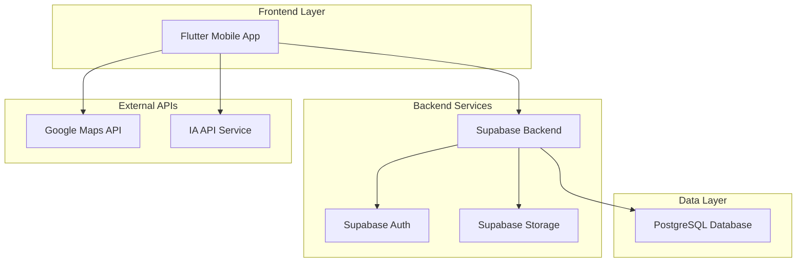

# Taste - Estrutura Técnica e Arquitetura de Arquivos

## 1. Arquitetura Geral do Sistema



## 2. Estrutura de Pastas do Projeto Flutter

```
taste_app/
├── android/                          # Configurações Android
├── ios/                              # Configurações iOS
├── lib/                              # Código fonte principal
│   ├── core/                         # Funcionalidades centrais
│   │   ├── constants/                # Constantes da aplicação
│   │   │   ├── app_constants.dart
│   │   │   ├── api_constants.dart
│   │   │   └── theme_constants.dart
│   │   ├── config/                   # Configurações
│   │   │   ├── app_config.dart
│   │   │   ├── supabase_config.dart
│   │   │   └── maps_config.dart
│   │   ├── errors/                   # Tratamento de erros
│   │   │   ├── exceptions.dart
│   │   │   └── failures.dart
│   │   ├── network/                  # Camada de rede
│   │   │   ├── api_client.dart
│   │   │   ├── network_info.dart
│   │   │   └── interceptors/
│   │   ├── utils/                    # Utilitários
│   │   │   ├── date_utils.dart
│   │   │   ├── location_utils.dart
│   │   │   ├── string_utils.dart
│   │   │   └── validation_utils.dart
│   │   └── theme/                    # Tema da aplicação
│   │       ├── app_theme.dart
│   │       ├── colors.dart
│   │       ├── text_styles.dart
│   │       └── dimensions.dart
│   ├── data/                         # Camada de dados
│   │   ├── datasources/              # Fontes de dados
│   │   │   ├── local/                # Dados locais
│   │   │   │   ├── local_storage.dart
│   │   │   │   ├── cache_manager.dart
│   │   │   │   └── hive_boxes.dart
│   │   │   ├── remote/               # Dados remotos
│   │   │   │   ├── supabase_client.dart
│   │   │   │   ├── ai_api_client.dart
│   │   │   │   ├── maps_api_client.dart
│   │   │   │   └── restaurant_remote_datasource.dart
│   │   ├── models/                   # Modelos de dados
│   │   │   ├── restaurant_model.dart
│   │   │   ├── user_model.dart
│   │   │   ├── review_model.dart
│   │   │   ├── category_model.dart
│   │   │   ├── search_result_model.dart
│   │   │   └── location_model.dart
│   │   └── repositories/             # Implementação dos repositórios
│   │       ├── restaurant_repository_impl.dart
│   │       ├── user_repository_impl.dart
│   │       ├── search_repository_impl.dart
│   │       ├── location_repository_impl.dart
│   │       └── auth_repository_impl.dart
│   ├── domain/                       # Camada de domínio
│   │   ├── entities/                 # Entidades de negócio
│   │   │   ├── restaurant.dart
│   │   │   ├── user.dart
│   │   │   ├── review.dart
│   │   │   ├── category.dart
│   │   │   ├── search_query.dart
│   │   │   └── location.dart
│   │   ├── repositories/             # Contratos dos repositórios
│   │   │   ├── restaurant_repository.dart
│   │   │   ├── user_repository.dart
│   │   │   ├── search_repository.dart
│   │   │   ├── location_repository.dart
│   │   │   └── auth_repository.dart
│   │   └── usecases/                 # Casos de uso
│   │       ├── search/
│   │       │   ├── search_restaurants.dart
│   │       │   ├── get_ai_interpretation.dart
│   │       │   └── apply_filters.dart
│   │       ├── restaurant/
│   │       │   ├── get_restaurant_details.dart
│   │       │   ├── get_nearby_restaurants.dart
│   │       │   └── get_restaurants_by_category.dart
│   │       ├── favorites/
│   │       │   ├── add_to_favorites.dart
│   │       │   ├── remove_from_favorites.dart
│   │       │   └── get_user_favorites.dart
│   │       ├── reviews/
│   │       │   ├── submit_review.dart
│   │       │   ├── get_restaurant_reviews.dart
│   │       │   └── calculate_average_rating.dart
│   │       ├── location/
│   │       │   ├── get_current_location.dart
│   │       │   ├── calculate_distance.dart
│   │       │   └── search_by_location.dart
│   │       └── auth/
│   │           ├── login_user.dart
│   │           ├── register_user.dart
│   │           ├── logout_user.dart
│   │           └── get_current_user.dart
│   ├── presentation/                 # Camada de apresentação
│   │   ├── bloc/                     # Gerenciamento de estado (BLoC)
│   │   │   ├── search/
│   │   │   │   ├── search_bloc.dart
│   │   │   │   ├── search_event.dart
│   │   │   │   └── search_state.dart
│   │   │   ├── restaurant/
│   │   │   │   ├── restaurant_bloc.dart
│   │   │   │   ├── restaurant_event.dart
│   │   │   │   └── restaurant_state.dart
│   │   │   ├── favorites/
│   │   │   │   ├── favorites_bloc.dart
│   │   │   │   ├── favorites_event.dart
│   │   │   │   └── favorites_state.dart
│   │   │   ├── location/
│   │   │   │   ├── location_bloc.dart
│   │   │   │   ├── location_event.dart
│   │   │   │   └── location_state.dart
│   │   │   └── auth/
│   │   │       ├── auth_bloc.dart
│   │   │       ├── auth_event.dart
│   │   │       └── auth_state.dart
│   │   ├── pages/                    # Páginas da aplicação
│   │   │   ├── splash/
│   │   │   │   └── splash_page.dart
│   │   │   ├── onboarding/
│   │   │   │   ├── onboarding_page.dart
│   │   │   │   └── widgets/
│   │   │   │       ├── onboarding_slide.dart
│   │   │   │       └── page_indicator.dart
│   │   │   ├── home/
│   │   │   │   ├── home_page.dart
│   │   │   │   └── widgets/
│   │   │   │       ├── search_bar_widget.dart
│   │   │   │       ├── category_grid.dart
│   │   │   │       ├── featured_restaurants.dart
│   │   │   │       └── location_header.dart
│   │   │   ├── search/
│   │   │   │   ├── search_page.dart
│   │   │   │   ├── search_results_page.dart
│   │   │   │   ├── map_search_page.dart
│   │   │   │   ├── empty_state_page.dart
│   │   │   │   └── widgets/
│   │   │   │       ├── restaurant_card.dart
│   │   │   │       ├── map_view.dart
│   │   │   │       ├── map_pin_widget.dart
│   │   │   │       ├── filter_bottom_sheet.dart
│   │   │   │       ├── view_toggle_button.dart
│   │   │   │       └── empty_state_widget.dart
│   │   │   ├── restaurant/
│   │   │   │   ├── restaurant_detail_page.dart
│   │   │   │   └── widgets/
│   │   │   │       ├── restaurant_hero_header.dart
│   │   │   │       ├── restaurant_info_section.dart
│   │   │   │       ├── restaurant_rating.dart
│   │   │   │       ├── restaurant_description.dart
│   │   │   │       ├── restaurant_mini_map.dart
│   │   │   │       ├── action_buttons_row.dart
│   │   │   │       └── reviews_section.dart
│   │   │   ├── favorites/
│   │   │   │   ├── favorites_page.dart
│   │   │   │   ├── user_lists_page.dart
│   │   │   │   ├── list_detail_page.dart
│   │   │   │   └── widgets/
│   │   │   │       ├── favorite_item.dart
│   │   │   │       ├── user_list_card.dart
│   │   │   │       ├── restaurant_list_item.dart
│   │   │   │       └── quick_review_dialog.dart
│   │   │   ├── profile/
│   │   │   │   ├── profile_page.dart
│   │   │   │   ├── edit_profile_page.dart
│   │   │   │   └── widgets/
│   │   │   │       ├── profile_greeting.dart
│   │   │   │       ├── my_lists_section.dart
│   │   │   │       ├── profile_waves_background.dart
│   │   │   │       └── settings_list.dart
│   │   │   └── auth/
│   │   │       ├── login_page.dart
│   │   │       ├── register_page.dart
│   │   │       └── widgets/
│   │   │           ├── auth_form.dart
│   │   │           └── social_login_buttons.dart
│   │   ├── widgets/                  # Widgets compartilhados
│   │   │   ├── common/
│   │   │   │   ├── custom_app_bar.dart
│   │   │   │   ├── custom_button.dart
│   │   │   │   ├── custom_text_field.dart
│   │   │   │   ├── loading_widget.dart
│   │   │   │   ├── error_widget.dart
│   │   │   │   ├── empty_state_widget.dart
│   │   │   │   ├── emoji_widget.dart
│   │   │   │   ├── gradient_background.dart
│   │   │   │   ├── rounded_card.dart
│   │   │   │   ├── category_icon_widget.dart
│   │   │   │   ├── search_field_widget.dart
│   │   │   │   ├── map_pin_emoji.dart
│   │   │   │   ├── action_button_row.dart
│   │   │   │   ├── greeting_text.dart
│   │   │   │   ├── list_category_card.dart
│   │   │   │   ├── waves_decoration.dart
│   │   │   │   ├── rating_stars.dart
│   │   │   │   ├── distance_badge.dart
│   │   │   │   ├── opening_hours_badge.dart
│   │   │   │   └── favorite_button.dart
│   │   │   ├── cards/
│   │   │   │   ├── restaurant_card.dart
│   │   │   │   ├── category_card.dart
│   │   │   │   └── review_card.dart
│   │   │   └── dialogs/
│   │   │       ├── confirmation_dialog.dart
│   │   │       ├── rating_dialog.dart
│   │   │       └── location_permission_dialog.dart
│   │   └── routes/                   # Roteamento
│   │       ├── app_router.dart
│   │       ├── route_names.dart
│   │       └── route_generator.dart
│   ├── injection_container.dart      # Injeção de dependência
│   └── main.dart                     # Ponto de entrada
├── test/                             # Testes
│   ├── unit/                         # Testes unitários
│   ├── widget/                       # Testes de widget
│   └── integration/                  # Testes de integração
├── assets/                           # Recursos estáticos
│   ├── images/                       # Imagens
│   ├── icons/                        # Ícones
│   ├── fonts/                        # Fontes
│   └── data/                         # Dados estáticos
├── pubspec.yaml                      # Dependências Flutter
├── analysis_options.yaml             # Regras de análise
├── README.md                         # Documentação
└── .env                              # Variáveis de ambiente
```

## 3. Ficha Técnica Completa

### 3.1 Tecnologias Principais

| Categoria                  | Tecnologia    | Versão | Propósito                       |
| -------------------------- | ------------- | ------ | ------------------------------- |
| **Framework Mobile**       | Flutter       | 3.16+  | Desenvolvimento multiplataforma |
| **Linguagem**              | Dart          | 3.2+   | Linguagem principal             |
| **Backend**                | Supabase      | Latest | Backend-as-a-Service            |
| **Banco de Dados**         | PostgreSQL    | 15+    | Banco relacional (via Supabase) |
| **Autenticação**           | Supabase Auth | Latest | Sistema de autenticação         |
| **Estado**                 | Flutter BLoC  | 8.1+   | Gerenciamento de estado         |
| **Injeção de Dependência** | GetIt         | 7.6+   | Service locator                 |
| **Roteamento**             | Go Router     | 12+    | Navegação declarativa           |
| **Onboarding**             | Introduction Screen | 3.1+ | Telas de apresentação inicial |
| **Animações**              | Lottie        | 2.7+   | Animações e micro-interações    |

### 3.2 Dependências Flutter (pubspec.yaml)

```yaml
name: taste_app
description: App de descoberta de restaurantes com IA
version: 1.0.0+1

environment:
  sdk: '>=3.2.0 <4.0.0'
  flutter: ">=3.16.0"

dependencies:
  flutter:
    sdk: flutter
  
  # Core
  cupertino_icons: ^1.0.6
  
  # State Management
  flutter_bloc: ^8.1.3
  equatable: ^2.0.5
  
  # Network & API
  supabase_flutter: ^2.0.0
  dio: ^5.3.2
  connectivity_plus: ^5.0.1
  
  # Local Storage
  hive: ^2.2.3
  hive_flutter: ^1.1.0
  shared_preferences: ^2.2.2
  
  # Location & Maps
  geolocator: ^10.1.0
  google_maps_flutter: ^2.5.0
  geocoding: ^2.1.1
  
  # UI & UX
  cached_network_image: ^3.3.0
  shimmer: ^3.0.0
  lottie: ^2.7.0
  flutter_svg: ^2.0.9
  introduction_screen: ^3.1.12
  smooth_page_indicator: ^1.1.0
  
  # Navigation
  go_router: ^12.1.1
  
  # Dependency Injection
  get_it: ^7.6.4
  injectable: ^2.3.2
  
  # Utils
  intl: ^0.18.1
  url_launcher: ^6.2.1
  permission_handler: ^11.0.1
  image_picker: ^1.0.4
  
  # Environment
  flutter_dotenv: ^5.1.0
  
  # Analytics (Future)
  # firebase_analytics: ^10.7.0
  # firebase_crashlytics: ^3.4.8

dev_dependencies:
  flutter_test:
    sdk: flutter
  
  # Code Generation
  build_runner: ^2.4.7
  hive_generator: ^2.0.1
  injectable_generator: ^2.4.1
  json_annotation: ^4.8.1
  json_serializable: ^6.7.1
  
  # Testing
  mockito: ^5.4.2
  bloc_test: ^9.1.5
  
  # Linting
  flutter_lints: ^3.0.1
  very_good_analysis: ^5.1.0

flutter:
  uses-material-design: true
  
  assets:
    - assets/images/
    - assets/icons/
    - assets/data/
    - .env
  
  fonts:
    - family: Poppins
      fonts:
        - asset: assets/fonts/Poppins-Regular.ttf
        - asset: assets/fonts/Poppins-Medium.ttf
          weight: 500
        - asset: assets/fonts/Poppins-SemiBold.ttf
          weight: 600
        - asset: assets/fonts/Poppins-Bold.ttf
          weight: 700
```

### 3.3 Configurações de Ambiente

#### 3.3.1 Arquivo .env

```env
# Supabase
SUPABASE_URL=your_supabase_url
SUPABASE_ANON_KEY=your_supabase_anon_key

# Google Maps
GOOGLE_MAPS_API_KEY=your_google_maps_key

# AI API
OPENAI_API_KEY=your_openai_key
AI_API_BASE_URL=https://api.openai.com/v1

# App Config
APP_NAME=Taste
APP_VERSION=1.0.0
ENVIRONMENT=development

# Analytics (Future)
# FIREBASE_PROJECT_ID=your_project_id
```

#### 3.3.2 Configuração Android (android/app/build.gradle)

```gradle
android {
    compileSdkVersion 34
    ndkVersion flutter.ndkVersion

    defaultConfig {
        applicationId "com.taste.app"
        minSdkVersion 21
        targetSdkVersion 34
        versionCode flutterVersionCode.toInteger()
        versionName flutterVersionName
        
        // Google Maps
        manifestPlaceholders = [
            googleMapsApiKey: "${GOOGLE_MAPS_API_KEY}"
        ]
    }
}
```

#### 3.3.3 Configuração iOS (ios/Runner/Info.plist)

```xml
<key>NSLocationWhenInUseUsageDescription</key>
<string>Este app precisa da sua localização para encontrar restaurantes próximos.</string>
<key>NSLocationAlwaysAndWhenInUseUsageDescription</key>
<string>Este app precisa da sua localização para encontrar restaurantes próximos.</string>
```

### 3.4 Estrutura do Banco de Dados (Supabase)

#### 3.4.1 Tabelas Principais

```sql
-- Tabela de Restaurantes
CREATE TABLE restaurants (
    id UUID PRIMARY KEY DEFAULT gen_random_uuid(),
    name VARCHAR(255) NOT NULL,
    description TEXT,
    address TEXT NOT NULL,
    latitude DECIMAL(10, 8),
    longitude DECIMAL(11, 8),
    phone VARCHAR(20),
    website VARCHAR(255),
    opening_hours JSONB,
    price_range INTEGER CHECK (price_range BETWEEN 1 AND 4),
    cuisine_types TEXT[],
    tags TEXT[],
    average_rating DECIMAL(3, 2) DEFAULT 0,
    total_reviews INTEGER DEFAULT 0,
    is_active BOOLEAN DEFAULT true,
    created_at TIMESTAMP WITH TIME ZONE DEFAULT NOW(),
    updated_at TIMESTAMP WITH TIME ZONE DEFAULT NOW()
);

-- Tabela de Categorias
CREATE TABLE categories (
    id UUID PRIMARY KEY DEFAULT gen_random_uuid(),
    name VARCHAR(100) NOT NULL,
    description TEXT,
    icon_emoji VARCHAR(10),
    color_hex VARCHAR(7),
    sort_order INTEGER,
    is_active BOOLEAN DEFAULT true,
    created_at TIMESTAMP WITH TIME ZONE DEFAULT NOW()
);

-- Tabela de Avaliações
CREATE TABLE reviews (
    id UUID PRIMARY KEY DEFAULT gen_random_uuid(),
    user_id UUID REFERENCES auth.users(id) ON DELETE CASCADE,
    restaurant_id UUID REFERENCES restaurants(id) ON DELETE CASCADE,
    rating INTEGER CHECK (rating BETWEEN 1 AND 5),
    comment TEXT,
    visit_date DATE,
    created_at TIMESTAMP WITH TIME ZONE DEFAULT NOW(),
    UNIQUE(user_id, restaurant_id)
);

-- Tabela de Favoritos
CREATE TABLE favorites (
    id UUID PRIMARY KEY DEFAULT gen_random_uuid(),
    user_id UUID REFERENCES auth.users(id) ON DELETE CASCADE,
    restaurant_id UUID REFERENCES restaurants(id) ON DELETE CASCADE,
    created_at TIMESTAMP WITH TIME ZONE DEFAULT NOW(),
    UNIQUE(user_id, restaurant_id)
);

-- Tabela de Histórico de Buscas
CREATE TABLE search_history (
    id UUID PRIMARY KEY DEFAULT gen_random_uuid(),
    user_id UUID REFERENCES auth.users(id) ON DELETE CASCADE,
    search_query TEXT NOT NULL,
    ai_interpretation JSONB,
    results_count INTEGER,
    user_location POINT,
    created_at TIMESTAMP WITH TIME ZONE DEFAULT NOW()
);
```

#### 3.4.2 Índices para Performance

```sql
-- Índices de geolocalização
CREATE INDEX idx_restaurants_location ON restaurants USING GIST (ll_to_earth(latitude, longitude));

-- Índices de busca
CREATE INDEX idx_restaurants_name ON restaurants USING GIN (to_tsvector('portuguese', name));
CREATE INDEX idx_restaurants_tags ON restaurants USING GIN (tags);
CREATE INDEX idx_restaurants_cuisine ON restaurants USING GIN (cuisine_types);

-- Índices de relacionamento
CREATE INDEX idx_reviews_restaurant ON reviews(restaurant_id);
CREATE INDEX idx_reviews_user ON reviews(user_id);
CREATE INDEX idx_favorites_user ON favorites(user_id);
```

### 3.5 APIs Externas

#### 3.5.1 Integração com IA (OpenAI)

```dart
class AIApiClient {
  static const String baseUrl = 'https://api.openai.com/v1';
  
  Future<SearchInterpretation> interpretSearch(String query) async {
    // Implementação da chamada para GPT
  }
}
```

#### 3.5.2 Integração Google Maps

```dart
class MapsService {
  static const String apiKey = 'YOUR_GOOGLE_MAPS_KEY';
  
  Future<List<PlaceResult>> searchNearby(LatLng location) async {
    // Implementação da busca por proximidade
  }
}
```

### 3.6 Especificações de Design Visual

#### 3.6.1 Paleta de Cores (Baseada nas Referências)
```dart
// lib/core/theme/app_colors.dart
class AppColors {
  // Cores Primárias
  static const Color primary = Color(0xFFFF6B35);     // Laranja vibrante
  static const Color primaryDark = Color(0xFFE55A2B);  // Laranja escuro
  static const Color secondary = Color(0xFF2E8B57);    // Verde mar
  
  // Cores de Fundo
  static const Color background = Color(0xFFFFFBF7);   // Bege claro
  static const Color surface = Color(0xFFFFFFFF);      // Branco
  static const Color cardBackground = Color(0xFFF8F8F8); // Cinza muito claro
  
  // Cores de Texto
  static const Color textPrimary = Color(0xFF2C2C2C);  // Cinza escuro
  static const Color textSecondary = Color(0xFF757575); // Cinza médio
  static const Color textLight = Color(0xFFB0B0B0);    // Cinza claro
  
  // Cores de Categoria (Grid)
  static const Color categoryRed = Color(0xFFE74C3C);
  static const Color categoryBlue = Color(0xFF3498DB);
  static const Color categoryGreen = Color(0xFF2ECC71);
  static const Color categoryYellow = Color(0xFFF39C12);
  static const Color categoryPurple = Color(0xFF9B59B6);
  static const Color categoryOrange = Color(0xFFE67E22);
}
```

#### 3.6.2 Tipografia
```dart
// lib/core/theme/app_text_styles.dart
class AppTextStyles {
  static const String fontFamily = 'Inter';
  
  // Títulos
  static const TextStyle h1 = TextStyle(
    fontFamily: fontFamily,
    fontSize: 28,
    fontWeight: FontWeight.bold,
    color: AppColors.textPrimary,
  );
  
  static const TextStyle h2 = TextStyle(
    fontFamily: fontFamily,
    fontSize: 24,
    fontWeight: FontWeight.w600,
    color: AppColors.textPrimary,
  );
  
  // Corpo do texto
  static const TextStyle bodyLarge = TextStyle(
    fontFamily: fontFamily,
    fontSize: 16,
    fontWeight: FontWeight.normal,
    color: AppColors.textPrimary,
  );
  
  static const TextStyle bodyMedium = TextStyle(
    fontFamily: fontFamily,
    fontSize: 14,
    fontWeight: FontWeight.normal,
    color: AppColors.textSecondary,
  );
  
  // Botões
  static const TextStyle buttonText = TextStyle(
    fontFamily: fontFamily,
    fontSize: 16,
    fontWeight: FontWeight.w600,
    color: Colors.white,
  );
}
```

#### 3.6.3 Componentes de UI
```dart
// lib/core/theme/app_theme.dart
class AppTheme {
  static const Color primaryBlue = Color(0xFF4A90E2);
  static const Color primaryPurple = Color(0xFF8E44AD);
  static const Color accentOrange = Color(0xFFFF6B35);
  static const Color darkBlue = Color(0xFF2C3E50);
  static const Color lightGray = Color(0xFFF8F9FA);
  static const Color white = Color(0xFFFFFFFF);
  static const Color emptyStateBlue = Color(0xFF6BB6FF);
  static const Color cardBackground = Color(0xFFFAFAFA);
  
  // Gradientes
  static const LinearGradient primaryGradient = LinearGradient(
    colors: [primaryBlue, primaryPurple],
    begin: Alignment.topLeft,
    end: Alignment.bottomRight,
  );
  
  static const LinearGradient profileWavesGradient = LinearGradient(
    colors: [Color(0xFF87CEEB), Color(0xFF4169E1)],
    begin: Alignment.topCenter,
    end: Alignment.bottomCenter,
  );
  
  // Tipografia
  static const String fontFamily = 'Poppins';
  static const double titleSize = 24.0;
  static const double subtitleSize = 18.0;
  static const double bodySize = 16.0;
  static const double captionSize = 14.0;
  static const double greetingSize = 28.0;
  
  // Bordas e raios
  static const double cardRadius = 16.0;
  static const double buttonRadius = 25.0;
  static const double searchFieldRadius = 25.0;
  
  // Espaçamentos
  static const double paddingSmall = 8.0;
  static const double paddingMedium = 16.0;
  static const double paddingLarge = 24.0;
  static const double paddingXLarge = 32.0;

  static ThemeData get lightTheme {
    return ThemeData(
      primaryColor: AppColors.primary,
      scaffoldBackgroundColor: AppColors.background,
      fontFamily: AppTextStyles.fontFamily,
      
      // Botões
      elevatedButtonTheme: ElevatedButtonThemeData(
        style: ElevatedButton.styleFrom(
          backgroundColor: AppColors.primary,
          foregroundColor: Colors.white,
          shape: RoundedRectangleBorder(
            borderRadius: BorderRadius.circular(12),
          ),
          padding: EdgeInsets.symmetric(horizontal: 24, vertical: 16),
        ),
      ),
      
      // Cards
      cardTheme: CardTheme(
        color: AppColors.surface,
        elevation: 2,
        shape: RoundedRectangleBorder(
          borderRadius: BorderRadius.circular(16),
        ),
      ),
      
      // Input Fields
      inputDecorationTheme: InputDecorationTheme(
        filled: true,
        fillColor: AppColors.cardBackground,
        border: OutlineInputBorder(
          borderRadius: BorderRadius.circular(12),
          borderSide: BorderSide.none,
        ),
        contentPadding: EdgeInsets.symmetric(horizontal: 16, vertical: 16),
      ),
    );
  }
}
```

### 3.7 Configurações de Deploy

#### 3.7.1 Android (Play Store)

* **Target SDK**: 34 (Android 14)

* **Min SDK**: 21 (Android 5.0)

* **Permissions**: Location, Internet, Network State

#### 3.7.2 iOS (App Store)

* **Deployment Target**: iOS 12.0+

* **Permissions**: Location When In Use

* **Capabilities**: Background App Refresh

### 3.8 Ferramentas de Desenvolvimento

| Ferramenta             | Propósito               | Configuração              |
| ---------------------- | ----------------------- | ------------------------- |
| **VS Code**            | IDE principal           | Extensions: Flutter, Dart |
| **Android Studio**     | Desenvolvimento Android | SDK 34, Emuladores        |
| **Xcode**              | Desenvolvimento iOS     | Simuladores iOS           |
| **Supabase Dashboard** | Gerenciamento backend   | Web interface             |
| **Postman**            | Teste de APIs           | Collections organizadas   |
| **Git**                | Controle de versão      | GitFlow workflow          |

### 3.9 Monitoramento e Analytics

#### 3.9.1 Logs e Debugging

* **Flutter Inspector**: Debug de widgets

* **Supabase Logs**: Monitoramento backend

* **Crashlytics**: Relatórios de crash (futuro)

#### 3.9.2 Performance

* **Flutter Performance**: Profiling de performance

* **Supabase Metrics**: Métricas de banco

* **Google Analytics**: Analytics de uso (futuro)

