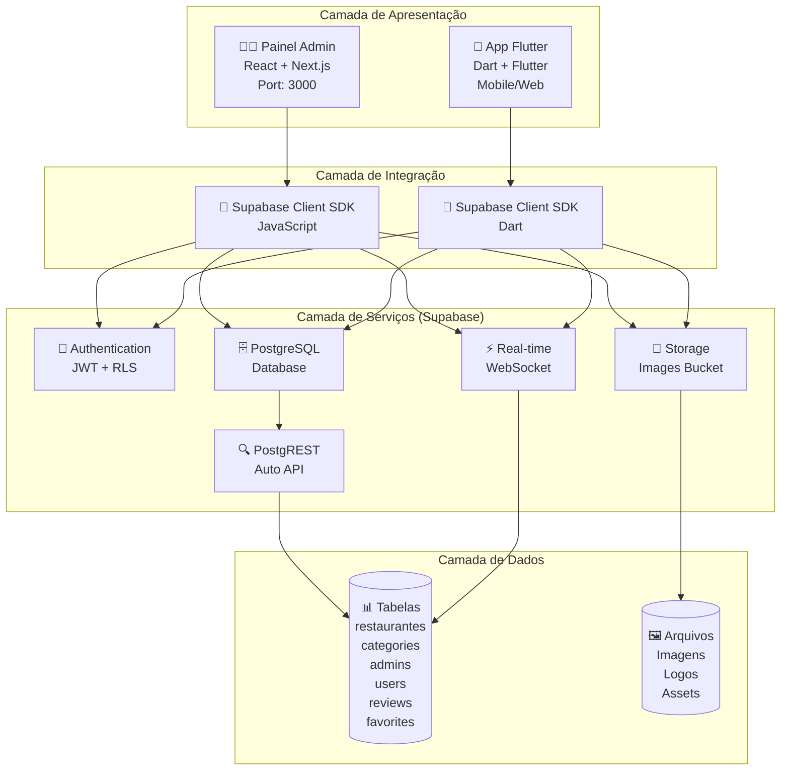
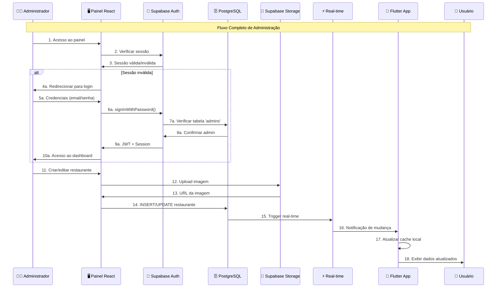
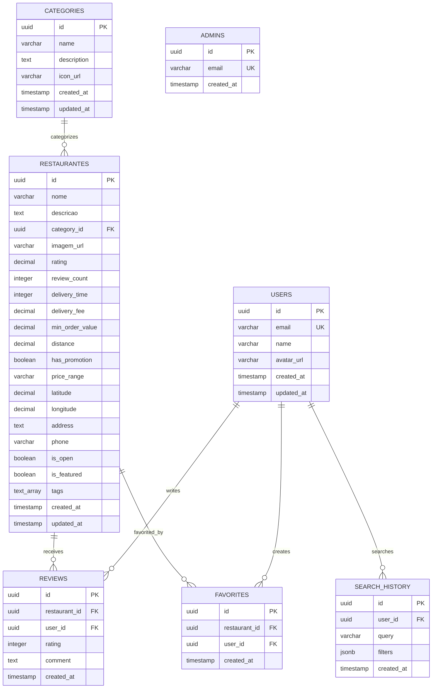

# Arquitetura Técnica Atualizada - Sistema Taste Integrado

## 1. Arquitetura Geral do Sistema

### 1.1 Visão Macro da Arquitetura



### 1.2 Fluxo de Dados Detalhado



## 2. Especificações Técnicas Detalhadas

### 2.1 Frontend - Painel Administrativo

**Stack Tecnológico:**
- **Framework**: Next.js 14 (App Router)
- **Linguagem**: TypeScript 5.x
- **Estilização**: Tailwind CSS 3.x
- **Estado**: React Hooks (useState, useEffect)
- **Roteamento**: Next.js App Router
- **Build**: Vite/Turbopack

**Estrutura de Arquivos:**
```
admin-panel/
├── src/
│   ├── app/
│   │   ├── login/page.tsx          # Página de autenticação
│   │   ├── dashboard/page.tsx      # Dashboard principal
│   │   ├── acesso-negado/page.tsx  # Página de erro
│   │   └── layout.tsx              # Layout global
│   ├── components/
│   │   ├── RestauranteTable.tsx    # Tabela de restaurantes
│   │   ├── RestauranteForm.tsx     # Formulário CRUD
│   │   └── ui/                     # Componentes base
│   ├── lib/
│   │   ├── supabase.ts            # Cliente Supabase
│   │   └── auth.ts                # Funções de autenticação
│   └── middleware.ts              # Proteção de rotas
├── public/
│   └── taste-test-logo.png        # Assets estáticos
├── .env.local                     # Variáveis de ambiente
└── package.json                   # Dependências
```

**Dependências Principais:**
```json
{
  "@supabase/supabase-js": "^2.x",
  "next": "14.x",
  "react": "18.x",
  "typescript": "5.x",
  "tailwindcss": "3.x"
}
```

### 2.2 Frontend - Aplicativo Flutter

**Stack Tecnológico:**
- **Framework**: Flutter 3.x
- **Linguagem**: Dart 3.x
- **Estado**: Provider Pattern
- **Navegação**: GoRouter
- **HTTP**: Supabase Dart Client

**Estrutura de Arquivos:**
```
taste_app/
├── lib/
│   ├── main.dart                   # Entry point
│   ├── config/
│   │   └── supabase_config.dart    # Configuração Supabase
│   ├── models/
│   │   ├── restaurant_model.dart   # Modelo de dados
│   │   └── category_model.dart     # Modelo de categoria
│   ├── repositories/
│   │   ├── restaurant_repository.dart # Acesso a dados
│   │   ├── favorites_repository.dart  # Favoritos
│   │   └── search_repository.dart     # Busca
│   ├── providers/
│   │   ├── discovery_provider.dart    # Estado da descoberta
│   │   ├── search_provider.dart       # Estado da busca
│   │   └── favorites_provider.dart    # Estado dos favoritos
│   ├── services/
│   │   ├── search_service.dart        # Lógica de busca
│   │   └── fuzzy_search_service.dart  # Busca fuzzy
│   ├── pages/
│   │   ├── discovery_page.dart        # Página principal
│   │   ├── search_page.dart           # Página de busca
│   │   ├── restaurant_details_page.dart # Detalhes
│   │   └── restaurant_reviews_page.dart # Reviews
│   └── widgets/
│       ├── restaurant_card.dart       # Card de restaurante
│       └── category_filter.dart       # Filtros
├── .env                              # Variáveis de ambiente
└── pubspec.yaml                      # Dependências
```

**Dependências Principais:**
```yaml
dependencies:
  flutter:
    sdk: flutter
  supabase_flutter: ^2.x
  provider: ^6.x
  go_router: ^13.x
  cached_network_image: ^3.x
  geolocator: ^10.x
```

### 2.3 Backend - Supabase

**Componentes:**
- **Database**: PostgreSQL 15.x
- **Authentication**: Supabase Auth (JWT)
- **Storage**: Supabase Storage (S3-compatible)
- **Real-time**: WebSocket subscriptions
- **API**: PostgREST auto-generated

**Configuração de Ambiente:**
```env
# Compartilhado entre admin-panel e taste_app
SUPABASE_URL=https://your-project.supabase.co
SUPABASE_ANON_KEY=eyJhbGciOiJIUzI1NiIsInR5cCI6IkpXVCJ9...
SUPABASE_SERVICE_KEY=eyJhbGciOiJIUzI1NiIsInR5cCI6IkpXVCJ9...
```

## 3. Modelo de Dados Completo

### 3.1 Esquema do Banco de Dados



### 3.2 DDL Completo com Índices

```sql
-- Extensões necessárias
CREATE EXTENSION IF NOT EXISTS "uuid-ossp";
CREATE EXTENSION IF NOT EXISTS "postgis";

-- Tabela de categorias
CREATE TABLE categories (
    id UUID PRIMARY KEY DEFAULT gen_random_uuid(),
    name VARCHAR(100) NOT NULL UNIQUE,
    description TEXT,
    icon_url VARCHAR(500),
    created_at TIMESTAMP WITH TIME ZONE DEFAULT NOW(),
    updated_at TIMESTAMP WITH TIME ZONE DEFAULT NOW()
);

-- Tabela de restaurantes (versão expandida)
CREATE TABLE restaurantes (
    id UUID PRIMARY KEY DEFAULT gen_random_uuid(),
    nome VARCHAR(255) NOT NULL,
    descricao TEXT NOT NULL,
    category_id UUID REFERENCES categories(id) ON DELETE SET NULL,
    imagem_url VARCHAR(500),
    rating DECIMAL(2,1) DEFAULT 4.0 CHECK (rating >= 0 AND rating <= 5),
    review_count INTEGER DEFAULT 0 CHECK (review_count >= 0),
    delivery_time INTEGER DEFAULT 30 CHECK (delivery_time > 0),
    delivery_fee DECIMAL(5,2) DEFAULT 5.0 CHECK (delivery_fee >= 0),
    min_order_value DECIMAL(6,2) DEFAULT 20.0 CHECK (min_order_value >= 0),
    distance DECIMAL(5,2) DEFAULT 0.0 CHECK (distance >= 0),
    has_promotion BOOLEAN DEFAULT false,
    price_range VARCHAR(10) DEFAULT '$$' CHECK (price_range IN ('$', '$$', '$$$', '$$$$')),
    latitude DECIMAL(10,8) NOT NULL CHECK (latitude >= -90 AND latitude <= 90),
    longitude DECIMAL(11,8) NOT NULL CHECK (longitude >= -180 AND longitude <= 180),
    address TEXT,
    phone VARCHAR(20),
    is_open BOOLEAN DEFAULT true,
    is_featured BOOLEAN DEFAULT false,
    tags TEXT[] DEFAULT '{}',
    created_at TIMESTAMP WITH TIME ZONE DEFAULT NOW(),
    updated_at TIMESTAMP WITH TIME ZONE DEFAULT NOW()
);

-- Tabela de administradores
CREATE TABLE admins (
    id UUID PRIMARY KEY DEFAULT gen_random_uuid(),
    email VARCHAR(255) UNIQUE NOT NULL,
    created_at TIMESTAMP WITH TIME ZONE DEFAULT NOW()
);

-- Tabela de usuários (para futuras funcionalidades)
CREATE TABLE users (
    id UUID PRIMARY KEY DEFAULT gen_random_uuid(),
    email VARCHAR(255) UNIQUE NOT NULL,
    name VARCHAR(255),
    avatar_url VARCHAR(500),
    created_at TIMESTAMP WITH TIME ZONE DEFAULT NOW(),
    updated_at TIMESTAMP WITH TIME ZONE DEFAULT NOW()
);

-- Tabela de reviews
CREATE TABLE reviews (
    id UUID PRIMARY KEY DEFAULT gen_random_uuid(),
    restaurant_id UUID NOT NULL REFERENCES restaurantes(id) ON DELETE CASCADE,
    user_id UUID NOT NULL REFERENCES users(id) ON DELETE CASCADE,
    rating INTEGER NOT NULL CHECK (rating >= 1 AND rating <= 5),
    comment TEXT,
    created_at TIMESTAMP WITH TIME ZONE DEFAULT NOW(),
    UNIQUE(restaurant_id, user_id)
);

-- Tabela de favoritos
CREATE TABLE favorites (
    id UUID PRIMARY KEY DEFAULT gen_random_uuid(),
    restaurant_id UUID NOT NULL REFERENCES restaurantes(id) ON DELETE CASCADE,
    user_id UUID NOT NULL REFERENCES users(id) ON DELETE CASCADE,
    created_at TIMESTAMP WITH TIME ZONE DEFAULT NOW(),
    UNIQUE(restaurant_id, user_id)
);

-- Tabela de histórico de busca
CREATE TABLE search_history (
    id UUID PRIMARY KEY DEFAULT gen_random_uuid(),
    user_id UUID REFERENCES users(id) ON DELETE CASCADE,
    query VARCHAR(255) NOT NULL,
    filters JSONB DEFAULT '{}',
    created_at TIMESTAMP WITH TIME ZONE DEFAULT NOW()
);

-- Índices para performance
CREATE INDEX idx_restaurantes_category ON restaurantes(category_id);
CREATE INDEX idx_restaurantes_location ON restaurantes USING GIST(ST_Point(longitude, latitude));
CREATE INDEX idx_restaurantes_rating ON restaurantes(rating DESC);
CREATE INDEX idx_restaurantes_featured ON restaurantes(is_featured) WHERE is_featured = true;
CREATE INDEX idx_restaurantes_open ON restaurantes(is_open) WHERE is_open = true;
CREATE INDEX idx_restaurantes_tags ON restaurantes USING GIN(tags);
CREATE INDEX idx_restaurantes_name_trgm ON restaurantes USING GIN(nome gin_trgm_ops);
CREATE INDEX idx_restaurantes_description_trgm ON restaurantes USING GIN(descricao gin_trgm_ops);

CREATE INDEX idx_reviews_restaurant ON reviews(restaurant_id);
CREATE INDEX idx_reviews_user ON reviews(user_id);
CREATE INDEX idx_reviews_rating ON reviews(rating DESC);

CREATE INDEX idx_favorites_restaurant ON favorites(restaurant_id);
CREATE INDEX idx_favorites_user ON favorites(user_id);

CREATE INDEX idx_search_history_user ON search_history(user_id);
CREATE INDEX idx_search_history_query ON search_history(query);
```

### 3.3 Triggers e Funções

```sql
-- Função para atualizar updated_at
CREATE OR REPLACE FUNCTION update_updated_at_column()
RETURNS TRIGGER AS $$
BEGIN
    NEW.updated_at = NOW();
    RETURN NEW;
END;
$$ language 'plpgsql';

-- Triggers para updated_at
CREATE TRIGGER update_restaurantes_updated_at 
    BEFORE UPDATE ON restaurantes 
    FOR EACH ROW 
    EXECUTE FUNCTION update_updated_at_column();

CREATE TRIGGER update_categories_updated_at 
    BEFORE UPDATE ON categories 
    FOR EACH ROW 
    EXECUTE FUNCTION update_updated_at_column();

CREATE TRIGGER update_users_updated_at 
    BEFORE UPDATE ON users 
    FOR EACH ROW 
    EXECUTE FUNCTION update_updated_at_column();

-- Função para atualizar rating automático
CREATE OR REPLACE FUNCTION update_restaurant_rating()
RETURNS TRIGGER AS $$
BEGIN
    UPDATE restaurantes 
    SET 
        rating = (
            SELECT ROUND(AVG(rating)::numeric, 1)
            FROM reviews 
            WHERE restaurant_id = COALESCE(NEW.restaurant_id, OLD.restaurant_id)
        ),
        review_count = (
            SELECT COUNT(*)
            FROM reviews 
            WHERE restaurant_id = COALESCE(NEW.restaurant_id, OLD.restaurant_id)
        )
    WHERE id = COALESCE(NEW.restaurant_id, OLD.restaurant_id);
    
    RETURN COALESCE(NEW, OLD);
END;
$$ language 'plpgsql';

-- Triggers para atualização automática de rating
CREATE TRIGGER update_rating_on_review_insert
    AFTER INSERT ON reviews
    FOR EACH ROW
    EXECUTE FUNCTION update_restaurant_rating();

CREATE TRIGGER update_rating_on_review_update
    AFTER UPDATE ON reviews
    FOR EACH ROW
    EXECUTE FUNCTION update_restaurant_rating();

CREATE TRIGGER update_rating_on_review_delete
    AFTER DELETE ON reviews
    FOR EACH ROW
    EXECUTE FUNCTION update_restaurant_rating();
```

## 4. Segurança e Políticas RLS

### 4.1 Configuração de Row Level Security

```sql
-- Habilitar RLS em todas as tabelas
ALTER TABLE restaurantes ENABLE ROW LEVEL SECURITY;
ALTER TABLE categories ENABLE ROW LEVEL SECURITY;
ALTER TABLE admins ENABLE ROW LEVEL SECURITY;
ALTER TABLE users ENABLE ROW LEVEL SECURITY;
ALTER TABLE reviews ENABLE ROW LEVEL SECURITY;
ALTER TABLE favorites ENABLE ROW LEVEL SECURITY;
ALTER TABLE search_history ENABLE ROW LEVEL SECURITY;

-- Políticas para restaurantes
CREATE POLICY "Public can view restaurants" ON restaurantes
    FOR SELECT USING (true);

CREATE POLICY "Admin can manage restaurants" ON restaurantes
    FOR ALL USING (
        auth.role() = 'authenticated' AND 
        auth.jwt() ->> 'email' IN (SELECT email FROM admins)
    );

-- Políticas para categorias
CREATE POLICY "Public can view categories" ON categories
    FOR SELECT USING (true);

CREATE POLICY "Admin can manage categories" ON categories
    FOR ALL USING (
        auth.role() = 'authenticated' AND 
        auth.jwt() ->> 'email' IN (SELECT email FROM admins)
    );

-- Políticas para admins
CREATE POLICY "Admin can view admins" ON admins
    FOR SELECT USING (
        auth.role() = 'authenticated' AND 
        auth.jwt() ->> 'email' IN (SELECT email FROM admins)
    );

-- Políticas para usuários
CREATE POLICY "Users can view their own data" ON users
    FOR ALL USING (auth.uid() = id);

CREATE POLICY "Public can view user profiles" ON users
    FOR SELECT USING (true);

-- Políticas para reviews
CREATE POLICY "Public can view reviews" ON reviews
    FOR SELECT USING (true);

CREATE POLICY "Users can manage their reviews" ON reviews
    FOR ALL USING (auth.uid() = user_id);

-- Políticas para favoritos
CREATE POLICY "Users can manage their favorites" ON favorites
    FOR ALL USING (auth.uid() = user_id);

-- Políticas para histórico de busca
CREATE POLICY "Users can manage their search history" ON search_history
    FOR ALL USING (auth.uid() = user_id);
```

### 4.2 Configuração de Storage

```sql
-- Políticas para bucket 'images'
INSERT INTO storage.policies (name, bucket_id, policy_definition, check)
VALUES (
    'Admin Upload Policy',
    'images',
    'bucket_id = ''images''',
    '(auth.role() = ''authenticated'' AND auth.jwt() ->> ''email'' IN (SELECT email FROM admins))'
);

INSERT INTO storage.policies (name, bucket_id, policy_definition, check)
VALUES (
    'Public Read Policy',
    'images',
    'bucket_id = ''images''',
    'true'
);

INSERT INTO storage.policies (name, bucket_id, policy_definition, check)
VALUES (
    'Admin Delete Policy',
    'images',
    'bucket_id = ''images''',
    '(auth.role() = ''authenticated'' AND auth.jwt() ->> ''email'' IN (SELECT email FROM admins))'
);
```

## 5. APIs e Endpoints

### 5.1 Funções PostgreSQL Customizadas

```sql
-- Função de busca avançada com geolocalização
CREATE OR REPLACE FUNCTION search_restaurants(
    search_term TEXT DEFAULT NULL,
    category_filter UUID DEFAULT NULL,
    lat DECIMAL DEFAULT NULL,
    lng DECIMAL DEFAULT NULL,
    radius_km INTEGER DEFAULT 10,
    min_rating DECIMAL DEFAULT 0,
    max_delivery_fee DECIMAL DEFAULT NULL,
    price_ranges TEXT[] DEFAULT NULL,
    has_promotion_filter BOOLEAN DEFAULT NULL,
    is_open_filter BOOLEAN DEFAULT NULL,
    limit_count INTEGER DEFAULT 50,
    offset_count INTEGER DEFAULT 0
)
RETURNS TABLE (
    id UUID,
    nome VARCHAR,
    descricao TEXT,
    category_name VARCHAR,
    imagem_url VARCHAR,
    rating DECIMAL,
    review_count INTEGER,
    delivery_time INTEGER,
    delivery_fee DECIMAL,
    min_order_value DECIMAL,
    distance_km DECIMAL,
    has_promotion BOOLEAN,
    price_range VARCHAR,
    latitude DECIMAL,
    longitude DECIMAL,
    address TEXT,
    phone VARCHAR,
    is_open BOOLEAN,
    is_featured BOOLEAN,
    tags TEXT[]
) AS $$
BEGIN
    RETURN QUERY
    SELECT 
        r.id,
        r.nome,
        r.descricao,
        c.name as category_name,
        r.imagem_url,
        r.rating,
        r.review_count,
        r.delivery_time,
        r.delivery_fee,
        r.min_order_value,
        CASE 
            WHEN lat IS NOT NULL AND lng IS NOT NULL THEN
                ST_Distance(
                    ST_Point(r.longitude, r.latitude)::geography,
                    ST_Point(lng, lat)::geography
                ) / 1000
            ELSE 0
        END as distance_km,
        r.has_promotion,
        r.price_range,
        r.latitude,
        r.longitude,
        r.address,
        r.phone,
        r.is_open,
        r.is_featured,
        r.tags
    FROM restaurantes r
    LEFT JOIN categories c ON r.category_id = c.id
    WHERE 
        -- Filtro de texto
        (search_term IS NULL OR (
            r.nome ILIKE '%' || search_term || '%' OR
            r.descricao ILIKE '%' || search_term || '%' OR
            c.name ILIKE '%' || search_term || '%' OR
            array_to_string(r.tags, ' ') ILIKE '%' || search_term || '%'
        ))
        -- Filtro de categoria
        AND (category_filter IS NULL OR r.category_id = category_filter)
        -- Filtro de localização
        AND (lat IS NULL OR lng IS NULL OR 
             ST_Distance(
                 ST_Point(r.longitude, r.latitude)::geography,
                 ST_Point(lng, lat)::geography
             ) / 1000 <= radius_km)
        -- Filtro de rating
        AND r.rating >= min_rating
        -- Filtro de taxa de entrega
        AND (max_delivery_fee IS NULL OR r.delivery_fee <= max_delivery_fee)
        -- Filtro de faixa de preço
        AND (price_ranges IS NULL OR r.price_range = ANY(price_ranges))
        -- Filtro de promoção
        AND (has_promotion_filter IS NULL OR r.has_promotion = has_promotion_filter)
        -- Filtro de aberto/fechado
        AND (is_open_filter IS NULL OR r.is_open = is_open_filter)
    ORDER BY 
        r.is_featured DESC,
        CASE WHEN lat IS NOT NULL AND lng IS NOT NULL THEN
            ST_Distance(
                ST_Point(r.longitude, r.latitude)::geography,
                ST_Point(lng, lat)::geography
            ) / 1000
        ELSE 0 END ASC,
        r.rating DESC,
        r.review_count DESC
    LIMIT limit_count
    OFFSET offset_count;
END;
$$ LANGUAGE plpgsql;

-- Função para obter estatísticas de restaurante
CREATE OR REPLACE FUNCTION get_restaurant_stats(restaurant_uuid UUID)
RETURNS TABLE (
    total_reviews INTEGER,
    avg_rating DECIMAL,
    rating_distribution JSONB,
    total_favorites INTEGER,
    recent_reviews JSONB
) AS $$
BEGIN
    RETURN QUERY
    SELECT 
        (SELECT COUNT(*)::INTEGER FROM reviews WHERE restaurant_id = restaurant_uuid),
        (SELECT ROUND(AVG(rating)::numeric, 2) FROM reviews WHERE restaurant_id = restaurant_uuid),
        (
            SELECT jsonb_object_agg(rating, count)
            FROM (
                SELECT rating, COUNT(*) as count
                FROM reviews 
                WHERE restaurant_id = restaurant_uuid
                GROUP BY rating
                ORDER BY rating
            ) rating_counts
        ),
        (SELECT COUNT(*)::INTEGER FROM favorites WHERE restaurant_id = restaurant_uuid),
        (
            SELECT jsonb_agg(
                jsonb_build_object(
                    'id', r.id,
                    'rating', r.rating,
                    'comment', r.comment,
                    'created_at', r.created_at,
                    'user_name', u.name
                )
            )
            FROM reviews r
            LEFT JOIN users u ON r.user_id = u.id
            WHERE r.restaurant_id = restaurant_uuid
            ORDER BY r.created_at DESC
            LIMIT 5
        );
END;
$$ LANGUAGE plpgsql;
```

### 5.2 Endpoints REST via Supabase

| Método | Endpoint | Descrição | Parâmetros | Resposta |
|--------|----------|-----------|------------|----------|
| GET | `/rest/v1/restaurantes` | Listar restaurantes | `select`, `limit`, `offset` | Array de restaurantes |
| GET | `/rest/v1/restaurantes?id=eq.{id}` | Obter restaurante específico | `id` | Objeto restaurante |
| POST | `/rest/v1/restaurantes` | Criar restaurante | Body JSON | Restaurante criado |
| PATCH | `/rest/v1/restaurantes?id=eq.{id}` | Atualizar restaurante | `id`, Body JSON | Restaurante atualizado |
| DELETE | `/rest/v1/restaurantes?id=eq.{id}` | Deletar restaurante | `id` | Status da operação |
| GET | `/rest/v1/categories` | Listar categorias | `select`, `limit` | Array de categorias |
| POST | `/rest/v1/rpc/search_restaurants` | Busca avançada | Parâmetros de busca | Resultados filtrados |
| POST | `/rest/v1/rpc/get_restaurant_stats` | Estatísticas | `restaurant_uuid` | Estatísticas do restaurante |

### 5.3 Real-time Subscriptions

```typescript
// Exemplo de subscription no Flutter
supabase
  .channel('restaurants')
  .on(
    RealtimeListenTypes.postgresChanges,
    {
      event: '*',
      schema: 'public',
      table: 'restaurantes',
    },
    (payload) {
      // Atualizar estado local
      handleRestaurantChange(payload);
    }
  )
  .subscribe();
```

## 6. Performance e Otimização

### 6.1 Estratégias de Cache

**Frontend (Flutter):**
```dart
// Cache local com TTL
class CacheManager {
  static const Duration _cacheTTL = Duration(minutes: 15);
  static final Map<String, CacheEntry> _cache = {};
  
  static T? get<T>(String key) {
    final entry = _cache[key];
    if (entry != null && !entry.isExpired) {
      return entry.data as T;
    }
    _cache.remove(key);
    return null;
  }
  
  static void set<T>(String key, T data) {
    _cache[key] = CacheEntry(data, DateTime.now().add(_cacheTTL));
  }
}
```

**Backend (PostgreSQL):**
```sql
-- Materialized views para consultas complexas
CREATE MATERIALIZED VIEW restaurant_summary AS
SELECT 
    r.id,
    r.nome,
    r.rating,
    r.review_count,
    c.name as category_name,
    COUNT(f.id) as favorite_count
FROM restaurantes r
LEFT JOIN categories c ON r.category_id = c.id
LEFT JOIN favorites f ON r.id = f.restaurant_id
GROUP BY r.id, r.nome, r.rating, r.review_count, c.name;

-- Refresh automático
CREATE OR REPLACE FUNCTION refresh_restaurant_summary()
RETURNS TRIGGER AS $$
BEGIN
    REFRESH MATERIALIZED VIEW CONCURRENTLY restaurant_summary;
    RETURN NULL;
END;
$$ LANGUAGE plpgsql;

CREATE TRIGGER refresh_summary_on_restaurant_change
    AFTER INSERT OR UPDATE OR DELETE ON restaurantes
    FOR EACH STATEMENT
    EXECUTE FUNCTION refresh_restaurant_summary();
```

### 6.2 Monitoramento e Logs

```sql
-- Tabela de logs de performance
CREATE TABLE performance_logs (
    id UUID PRIMARY KEY DEFAULT gen_random_uuid(),
    operation VARCHAR(100),
    duration_ms INTEGER,
    parameters JSONB,
    user_id UUID,
    created_at TIMESTAMP WITH TIME ZONE DEFAULT NOW()
);

-- Função para log automático
CREATE OR REPLACE FUNCTION log_performance(
    operation_name VARCHAR,
    start_time TIMESTAMP,
    params JSONB DEFAULT '{}'
)
RETURNS VOID AS $$
BEGIN
    INSERT INTO performance_logs (operation, duration_ms, parameters, user_id)
    VALUES (
        operation_name,
        EXTRACT(EPOCH FROM (NOW() - start_time)) * 1000,
        params,
        auth.uid()
    );
END;
$$ LANGUAGE plpgsql;
```

## 7. Deployment e DevOps

### 7.1 Configuração de Ambiente

**Desenvolvimento:**
```bash
# Painel Admin
cd admin-panel
npm install
npm run dev  # http://localhost:3000

# App Flutter
cd taste_app
flutter pub get
flutter run -d chrome  # Web
flutter run -d android  # Android
```

**Produção:**
```bash
# Build do Painel Admin
npm run build
npm start

# Build do App Flutter
flutter build web
flutter build apk --release
flutter build ios --release
```

### 7.2 Variáveis de Ambiente

```env
# .env.local (admin-panel)
NEXT_PUBLIC_SUPABASE_URL=https://your-project.supabase.co
NEXT_PUBLIC_SUPABASE_ANON_KEY=your-anon-key
NEXT_PUBLIC_ENVIRONMENT=production

# .env (taste_app)
SUPABASE_URL=https://your-project.supabase.co
SUPABASE_ANON_KEY=your-anon-key
SUPABASE_SERVICE_KEY=your-service-key
GOOGLE_MAPS_API_KEY=your-google-maps-key
ENVIRONMENT=production
```

### 7.3 CI/CD Pipeline

```yaml
# .github/workflows/deploy.yml
name: Deploy
on:
  push:
    branches: [main]

jobs:
  deploy-admin:
    runs-on: ubuntu-latest
    steps:
      - uses: actions/checkout@v3
      - uses: actions/setup-node@v3
        with:
          node-version: '18'
      - run: cd admin-panel && npm ci
      - run: cd admin-panel && npm run build
      - run: cd admin-panel && npm run test
      - uses: vercel/action@v1
        with:
          vercel-token: ${{ secrets.VERCEL_TOKEN }}
          vercel-project-id: ${{ secrets.VERCEL_PROJECT_ID }}
          working-directory: admin-panel

  deploy-app:
    runs-on: ubuntu-latest
    steps:
      - uses: actions/checkout@v3
      - uses: subosito/flutter-action@v2
        with:
          flutter-version: '3.x'
      - run: cd taste_app && flutter pub get
      - run: cd taste_app && flutter test
      - run: cd taste_app && flutter build web
      - run: cd taste_app && flutter build apk --release
```

---

## ✅ Status da Implementação

| Componente | Status | Observações |
|------------|--------|-------------|
| 🖥️ Painel Admin | ✅ Completo | CRUD funcional, upload de imagens |
| 📱 App Flutter | ✅ Completo | Integração com dados reais |
| 🗄️ Base de Dados | ✅ Expandida | Todas as tabelas e relacionamentos |
| 🔐 Autenticação | ⚠️ Parcial | Requer criação de usuário admin |
| 📁 Storage | ✅ Funcional | Upload e acesso público |
| ⚡ Real-time | ✅ Ativo | Sincronização automática |
| 🛡️ Segurança | ✅ Configurada | RLS e políticas implementadas |
| 📊 Performance | ✅ Otimizada | Índices e cache implementados |

**Próximos Passos:**
1. ✅ Resolver autenticação admin (criar usuário)
2. 🔄 Implementar sistema de reviews
3. 🔄 Adicionar notificações push
4. 🔄 Configurar analytics e monitoramento
5. 🔄 Implementar testes automatizados