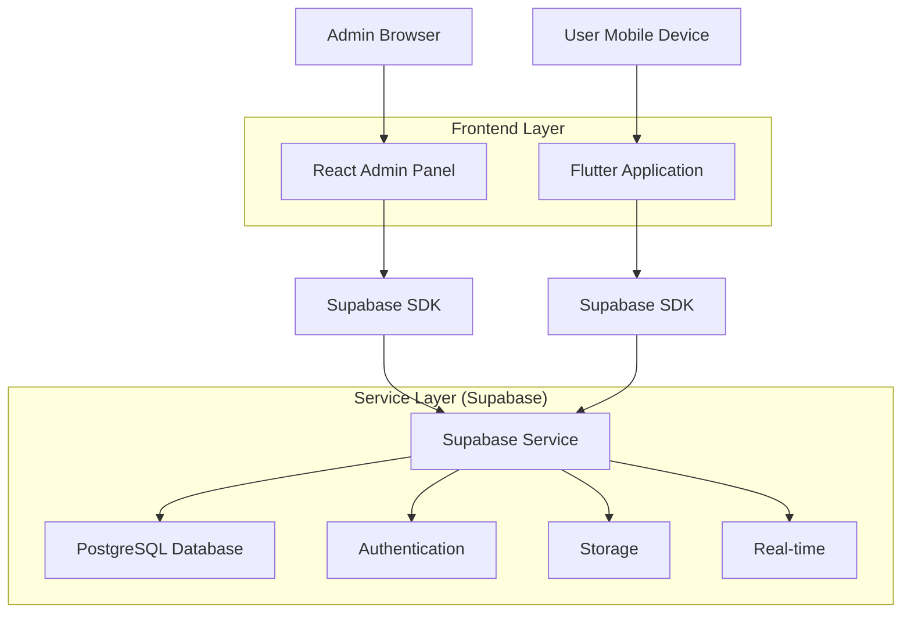
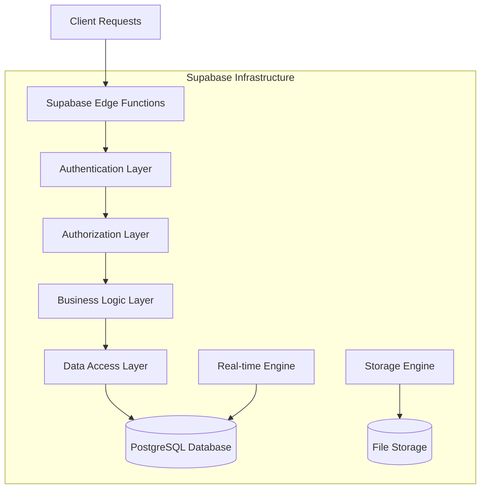
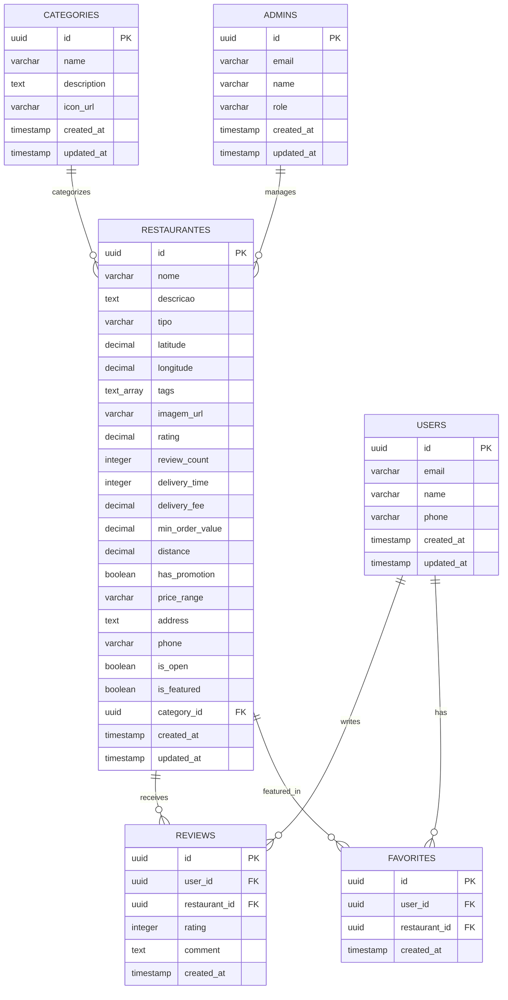

# Arquitetura Técnica - Integração Painel Administrativo

## 1. Arquitetura Geral



## 2. Descrição das Tecnologias

- **Frontend Admin**: React@18 + TypeScript + Tailwind CSS + Vite
- **Frontend Mobile**: Flutter@3.x + Dart
- **Backend**: Supabase (PostgreSQL + Auth + Storage + Real-time)
- **Autenticação**: Supabase Auth
- **Banco de Dados**: PostgreSQL (via Supabase)
- **Storage**: Supabase Storage
- **Real-time**: Supabase Real-time subscriptions

## 3. Definições de Rotas

### 3.1 Painel Administrativo (React)

| Rota | Propósito |
|------|----------|
| `/` | Dashboard principal com lista de restaurantes |
| `/login` | Página de autenticação de administradores |
| `/restaurants` | Gerenciamento de restaurantes |
| `/restaurants/new` | Criação de novo restaurante |
| `/restaurants/:id/edit` | Edição de restaurante existente |
| `/categories` | Gerenciamento de categorias |

### 3.2 Aplicativo Flutter

| Rota | Propósito |
|------|----------|
| `/` | Tela inicial com descoberta de restaurantes |
| `/search` | Tela de busca e filtros |
| `/restaurant/:id` | Detalhes do restaurante |
| `/favorites` | Restaurantes favoritos do usuário |
| `/profile` | Perfil do usuário |
| `/map` | Visualização em mapa |

## 4. Definições de API

### 4.1 APIs do Supabase (PostgreSQL Functions)

#### Busca de Restaurantes
```sql
-- Função para busca com filtros
CREATE OR REPLACE FUNCTION search_restaurants(
  search_term TEXT DEFAULT NULL,
  category_filter UUID DEFAULT NULL,
  lat DECIMAL DEFAULT NULL,
  lng DECIMAL DEFAULT NULL,
  radius_km INTEGER DEFAULT 10
)
RETURNS TABLE (
  id UUID,
  nome VARCHAR,
  descricao TEXT,
  categoria VARCHAR,
  imagem_url VARCHAR,
  rating DECIMAL,
  distance_km DECIMAL
)
AS $$
BEGIN
  RETURN QUERY
  SELECT 
    r.id,
    r.nome,
    r.descricao,
    c.name as categoria,
    r.imagem_url,
    r.rating,
    CASE 
      WHEN lat IS NOT NULL AND lng IS NOT NULL THEN
        ST_Distance(
          ST_Point(r.longitude, r.latitude)::geography,
          ST_Point(lng, lat)::geography
        ) / 1000
      ELSE 0
    END as distance_km
  FROM restaurantes r
  LEFT JOIN categories c ON r.category_id = c.id
  WHERE 
    (search_term IS NULL OR 
     r.nome ILIKE '%' || search_term || '%' OR
     r.descricao ILIKE '%' || search_term || '%' OR
     array_to_string(r.tags, ' ') ILIKE '%' || search_term || '%')
    AND (category_filter IS NULL OR r.category_id = category_filter)
    AND (lat IS NULL OR lng IS NULL OR 
         ST_Distance(
           ST_Point(r.longitude, r.latitude)::geography,
           ST_Point(lng, lat)::geography
         ) / 1000 <= radius_km)
  ORDER BY distance_km ASC, r.rating DESC;
END;
$$ LANGUAGE plpgsql;
```

### 4.2 APIs REST (via Supabase Client)

#### Restaurantes
```typescript
// GET /rest/v1/restaurantes
// Listar todos os restaurantes
interface GetRestaurantsResponse {
  id: string;
  nome: string;
  descricao: string;
  tipo: string;
  latitude: number;
  longitude: number;
  tags: string[];
  imagem_url: string;
  rating: number;
  review_count: number;
  delivery_time: number;
  delivery_fee: number;
  min_order_value: number;
  distance: number;
  has_promotion: boolean;
  price_range: string;
  address: string;
  phone: string;
  is_open: boolean;
  is_featured: boolean;
  category_id: string;
  created_at: string;
  updated_at: string;
  categories?: {
    id: string;
    name: string;
    description: string;
    icon_url: string;
  };
}

// POST /rest/v1/restaurantes
// Criar novo restaurante
interface CreateRestaurantRequest {
  nome: string;
  descricao: string;
  tipo: string;
  latitude: number;
  longitude: number;
  tags: string[];
  imagem_url: string;
  category_id: string;
  address?: string;
  phone?: string;
  rating?: number;
  delivery_time?: number;
  delivery_fee?: number;
  min_order_value?: number;
  price_range?: string;
  is_open?: boolean;
  is_featured?: boolean;
}

// PATCH /rest/v1/restaurantes?id=eq.{id}
// Atualizar restaurante
interface UpdateRestaurantRequest extends Partial<CreateRestaurantRequest> {
  updated_at?: string;
}

// DELETE /rest/v1/restaurantes?id=eq.{id}
// Deletar restaurante
```

#### Categorias
```typescript
// GET /rest/v1/categories
interface GetCategoriesResponse {
  id: string;
  name: string;
  description: string;
  icon_url: string;
  created_at: string;
  updated_at: string;
}

// POST /rest/v1/categories
interface CreateCategoryRequest {
  name: string;
  description?: string;
  icon_url?: string;
}
```

#### Upload de Imagens
```typescript
// POST /storage/v1/object/restaurant-images/{filename}
// Upload de imagem de restaurante
interface UploadImageResponse {
  Key: string;
  path: string;
  fullPath: string;
}
```

## 5. Arquitetura do Servidor



## 6. Modelo de Dados

### 6.1 Diagrama Entidade-Relacionamento



### 6.2 DDL (Data Definition Language)

```sql
-- Criar extensões necessárias
CREATE EXTENSION IF NOT EXISTS "uuid-ossp";
CREATE EXTENSION IF NOT EXISTS "postgis";

-- Tabela de categorias
CREATE TABLE categories (
    id UUID PRIMARY KEY DEFAULT uuid_generate_v4(),
    name VARCHAR(100) NOT NULL UNIQUE,
    description TEXT,
    icon_url VARCHAR(255),
    created_at TIMESTAMP WITH TIME ZONE DEFAULT NOW(),
    updated_at TIMESTAMP WITH TIME ZONE DEFAULT NOW()
);

-- Tabela de restaurantes (expandida)
CREATE TABLE restaurantes (
    id UUID PRIMARY KEY DEFAULT uuid_generate_v4(),
    nome VARCHAR(255) NOT NULL,
    descricao TEXT,
    tipo VARCHAR(100), -- Mantido para compatibilidade
    latitude DECIMAL(10, 8) NOT NULL,
    longitude DECIMAL(11, 8) NOT NULL,
    tags TEXT[],
    imagem_url VARCHAR(500),
    rating DECIMAL(2,1) DEFAULT 4.0 CHECK (rating >= 0 AND rating <= 5),
    review_count INTEGER DEFAULT 0,
    delivery_time INTEGER DEFAULT 30, -- em minutos
    delivery_fee DECIMAL(5,2) DEFAULT 5.0,
    min_order_value DECIMAL(6,2) DEFAULT 20.0,
    distance DECIMAL(5,2) DEFAULT 0.0,
    has_promotion BOOLEAN DEFAULT false,
    price_range VARCHAR(10) DEFAULT '$$' CHECK (price_range IN ('$', '$$', '$$$', '$$$$')),
    address TEXT,
    phone VARCHAR(20),
    is_open BOOLEAN DEFAULT true,
    is_featured BOOLEAN DEFAULT false,
    category_id UUID REFERENCES categories(id),
    created_at TIMESTAMP WITH TIME ZONE DEFAULT NOW(),
    updated_at TIMESTAMP WITH TIME ZONE DEFAULT NOW()
);

-- Tabela de usuários (para reviews e favoritos)
CREATE TABLE users (
    id UUID PRIMARY KEY DEFAULT uuid_generate_v4(),
    email VARCHAR(255) UNIQUE NOT NULL,
    name VARCHAR(255),
    phone VARCHAR(20),
    created_at TIMESTAMP WITH TIME ZONE DEFAULT NOW(),
    updated_at TIMESTAMP WITH TIME ZONE DEFAULT NOW()
);

-- Tabela de reviews
CREATE TABLE reviews (
    id UUID PRIMARY KEY DEFAULT uuid_generate_v4(),
    user_id UUID REFERENCES users(id) ON DELETE CASCADE,
    restaurant_id UUID REFERENCES restaurantes(id) ON DELETE CASCADE,
    rating INTEGER NOT NULL CHECK (rating >= 1 AND rating <= 5),
    comment TEXT,
    created_at TIMESTAMP WITH TIME ZONE DEFAULT NOW()
);

-- Tabela de favoritos
CREATE TABLE favorites (
    id UUID PRIMARY KEY DEFAULT uuid_generate_v4(),
    user_id UUID REFERENCES users(id) ON DELETE CASCADE,
    restaurant_id UUID REFERENCES restaurantes(id) ON DELETE CASCADE,
    created_at TIMESTAMP WITH TIME ZONE DEFAULT NOW(),
    UNIQUE(user_id, restaurant_id)
);

-- Tabela de administradores
CREATE TABLE admins (
    id UUID PRIMARY KEY DEFAULT uuid_generate_v4(),
    email VARCHAR(255) UNIQUE NOT NULL,
    name VARCHAR(255) NOT NULL,
    role VARCHAR(50) DEFAULT 'admin' CHECK (role IN ('admin', 'super_admin')),
    created_at TIMESTAMP WITH TIME ZONE DEFAULT NOW(),
    updated_at TIMESTAMP WITH TIME ZONE DEFAULT NOW()
);

-- Índices para performance
CREATE INDEX idx_restaurantes_category_id ON restaurantes(category_id);
CREATE INDEX idx_restaurantes_location ON restaurantes USING GIST (ST_Point(longitude, latitude));
CREATE INDEX idx_restaurantes_rating ON restaurantes(rating DESC);
CREATE INDEX idx_restaurantes_featured ON restaurantes(is_featured) WHERE is_featured = true;
CREATE INDEX idx_restaurantes_open ON restaurantes(is_open) WHERE is_open = true;
CREATE INDEX idx_reviews_restaurant_id ON reviews(restaurant_id);
CREATE INDEX idx_reviews_user_id ON reviews(user_id);
CREATE INDEX idx_favorites_user_id ON favorites(user_id);
CREATE INDEX idx_favorites_restaurant_id ON favorites(restaurant_id);

-- Trigger para atualizar updated_at automaticamente
CREATE OR REPLACE FUNCTION update_updated_at_column()
RETURNS TRIGGER AS $$
BEGIN
    NEW.updated_at = NOW();
    RETURN NEW;
END;
$$ language 'plpgsql';

CREATE TRIGGER update_restaurantes_updated_at BEFORE UPDATE ON restaurantes
    FOR EACH ROW EXECUTE FUNCTION update_updated_at_column();

CREATE TRIGGER update_categories_updated_at BEFORE UPDATE ON categories
    FOR EACH ROW EXECUTE FUNCTION update_updated_at_column();

CREATE TRIGGER update_users_updated_at BEFORE UPDATE ON users
    FOR EACH ROW EXECUTE FUNCTION update_updated_at_column();

CREATE TRIGGER update_admins_updated_at BEFORE UPDATE ON admins
    FOR EACH ROW EXECUTE FUNCTION update_updated_at_column();

-- Trigger para atualizar rating médio dos restaurantes
CREATE OR REPLACE FUNCTION update_restaurant_rating()
RETURNS TRIGGER AS $$
BEGIN
    UPDATE restaurantes 
    SET 
        rating = (
            SELECT COALESCE(AVG(rating), 0) 
            FROM reviews 
            WHERE restaurant_id = COALESCE(NEW.restaurant_id, OLD.restaurant_id)
        ),
        review_count = (
            SELECT COUNT(*) 
            FROM reviews 
            WHERE restaurant_id = COALESCE(NEW.restaurant_id, OLD.restaurant_id)
        )
    WHERE id = COALESCE(NEW.restaurant_id, OLD.restaurant_id);
    
    RETURN COALESCE(NEW, OLD);
END;
$$ language 'plpgsql';

CREATE TRIGGER update_restaurant_rating_on_review_change
    AFTER INSERT OR UPDATE OR DELETE ON reviews
    FOR EACH ROW EXECUTE FUNCTION update_restaurant_rating();

-- Políticas de segurança (RLS)
ALTER TABLE restaurantes ENABLE ROW LEVEL SECURITY;
ALTER TABLE categories ENABLE ROW LEVEL SECURITY;
ALTER TABLE reviews ENABLE ROW LEVEL SECURITY;
ALTER TABLE favorites ENABLE ROW LEVEL SECURITY;
ALTER TABLE admins ENABLE ROW LEVEL SECURITY;

-- Políticas para restaurantes
CREATE POLICY "Restaurantes são visíveis para todos" ON restaurantes
    FOR SELECT USING (true);

CREATE POLICY "Apenas admins podem modificar restaurantes" ON restaurantes
    FOR ALL USING (
        EXISTS (
            SELECT 1 FROM admins 
            WHERE email = auth.jwt() ->> 'email'
        )
    );

-- Políticas para categorias
CREATE POLICY "Categorias são visíveis para todos" ON categories
    FOR SELECT USING (true);

CREATE POLICY "Apenas admins podem modificar categorias" ON categories
    FOR ALL USING (
        EXISTS (
            SELECT 1 FROM admins 
            WHERE email = auth.jwt() ->> 'email'
        )
    );

-- Políticas para reviews
CREATE POLICY "Reviews são visíveis para todos" ON reviews
    FOR SELECT USING (true);

CREATE POLICY "Usuários podem criar suas próprias reviews" ON reviews
    FOR INSERT WITH CHECK (auth.uid() = user_id);

CREATE POLICY "Usuários podem editar suas próprias reviews" ON reviews
    FOR UPDATE USING (auth.uid() = user_id);

CREATE POLICY "Usuários podem deletar suas próprias reviews" ON reviews
    FOR DELETE USING (auth.uid() = user_id);

-- Políticas para favoritos
CREATE POLICY "Usuários podem ver apenas seus favoritos" ON favorites
    FOR SELECT USING (auth.uid() = user_id);

CREATE POLICY "Usuários podem gerenciar seus favoritos" ON favorites
    FOR ALL USING (auth.uid() = user_id);

-- Políticas para admins
CREATE POLICY "Apenas super admins podem ver admins" ON admins
    FOR SELECT USING (
        EXISTS (
            SELECT 1 FROM admins 
            WHERE email = auth.jwt() ->> 'email' AND role = 'super_admin'
        )
    );

-- Dados iniciais
INSERT INTO categories (name, description, icon_url) VALUES
('Italiana', 'Restaurantes especializados em culinária italiana', 'https://example.com/icons/italian.png'),
('Brasileira', 'Culinária tradicional brasileira', 'https://example.com/icons/brazilian.png'),
('Japonesa', 'Sushi, sashimi e pratos japoneses', 'https://example.com/icons/japanese.png'),
('Fast Food', 'Comida rápida e lanches', 'https://example.com/icons/fastfood.png'),
('Vegetariana', 'Opções vegetarianas e veganas', 'https://example.com/icons/vegetarian.png');

-- Admin inicial (ajustar email conforme necessário)
INSERT INTO admins (email, name, role) VALUES
('admin@taste.com', 'Administrador Principal', 'super_admin');
```

## 7. Configuração de Segurança

### 7.1 Variáveis de Ambiente

**Painel Administrativo (.env):**
```env
NEXT_PUBLIC_SUPABASE_URL=https://your-project.supabase.co
NEXT_PUBLIC_SUPABASE_ANON_KEY=your-anon-key
SUPABASE_SERVICE_ROLE_KEY=your-service-role-key
NEXT_PUBLIC_APP_ENV=production
```

**Flutter App (.env):**
```env
SUPABASE_URL=https://your-project.supabase.co
SUPABASE_ANON_KEY=your-anon-key
GOOGLE_MAPS_API_KEY=your-google-maps-key
```

### 7.2 Configuração de CORS

```sql
-- Configurar CORS no Supabase
SELECT pg_catalog.set_config('app.cors_origins', 'http://localhost:3000,https://your-admin-domain.com', false);
```

## 8. Monitoramento e Logs

### 8.1 Métricas Importantes

- Tempo de resposta das queries
- Número de requests por minuto
- Taxa de erro das APIs
- Uso de storage
- Conexões ativas no banco

### 8.2 Logs de Auditoria

```sql
-- Tabela de logs de auditoria
CREATE TABLE audit_logs (
    id UUID PRIMARY KEY DEFAULT uuid_generate_v4(),
    table_name VARCHAR(50) NOT NULL,
    operation VARCHAR(10) NOT NULL, -- INSERT, UPDATE, DELETE
    old_values JSONB,
    new_values JSONB,
    user_id UUID,
    user_email VARCHAR(255),
    timestamp TIMESTAMP WITH TIME ZONE DEFAULT NOW()
);

-- Função para auditoria
CREATE OR REPLACE FUNCTION audit_trigger_function()
RETURNS TRIGGER AS $$
BEGIN
    INSERT INTO audit_logs (
        table_name,
        operation,
        old_values,
        new_values,
        user_email
    ) VALUES (
        TG_TABLE_NAME,
        TG_OP,
        CASE WHEN TG_OP = 'DELETE' THEN row_to_json(OLD) ELSE NULL END,
        CASE WHEN TG_OP = 'INSERT' OR TG_OP = 'UPDATE' THEN row_to_json(NEW) ELSE NULL END,
        auth.jwt() ->> 'email'
    );
    
    RETURN COALESCE(NEW, OLD);
END;
$$ LANGUAGE plpgsql;

-- Aplicar auditoria nas tabelas principais
CREATE TRIGGER audit_restaurantes
    AFTER INSERT OR UPDATE OR DELETE ON restaurantes
    FOR EACH ROW EXECUTE FUNCTION audit_trigger_function();

CREATE TRIGGER audit_categories
    AFTER INSERT OR UPDATE OR DELETE ON categories
    FOR EACH ROW EXECUTE FUNCTION audit_trigger_function();
```

Esta arquitetura técnica fornece uma base sólida e escalável para a integração completa entre o painel administrativo e o aplicativo Flutter, garantindo segurança, performance e facilidade de manutenção.