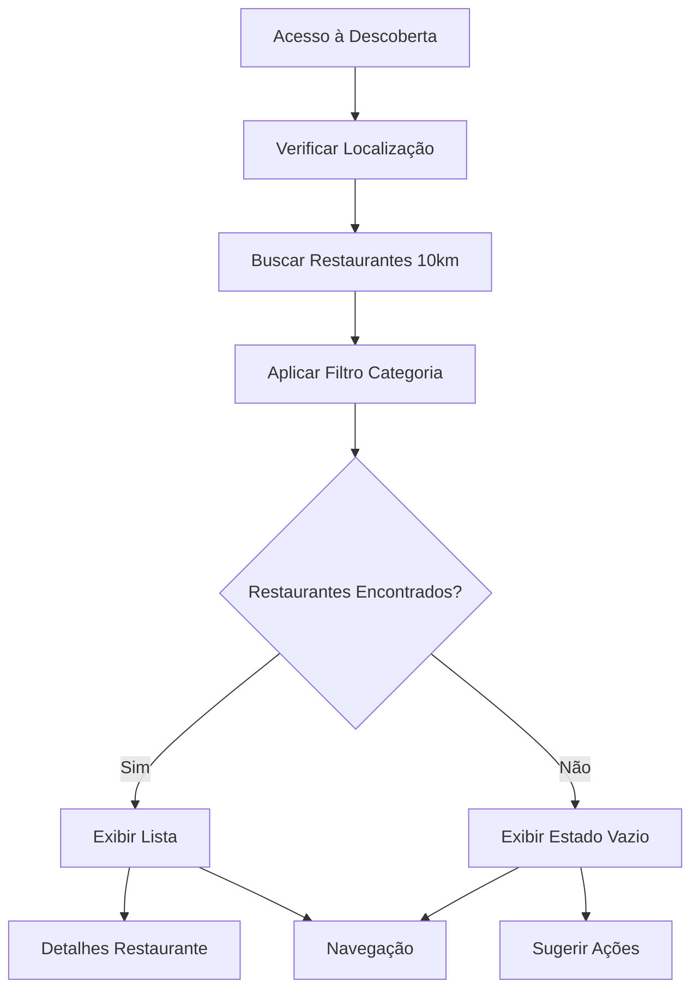

# Página de Descoberta de Restaurantes

## 1. Visão Geral do Produto

Página de descoberta que exibe restaurantes próximos ao usuário (até 10km) filtrados por categoria selecionada, com interface intuitiva e tratamento adequado para casos sem resultados.

A página resolve o problema de encontrar restaurantes relevantes baseados na localização atual e preferências de categoria do usuário, proporcionando uma experiência de descoberta personalizada e geograficamente relevante.

## 2. Funcionalidades Principais

### 2.1 Papéis de Usuário

| Papel | Método de Registro | Permissões Principais |
|-------|-------------------|----------------------|
| Usuário Comum | Acesso direto via app | Pode visualizar restaurantes próximos, filtrar por categoria |

### 2.2 Módulo de Funcionalidades

Nossa página de descoberta consiste nas seguintes páginas principais:

1. **Página de Descoberta**: header com logo, mapa de localização, lista de restaurantes filtrados, barra de navegação.
2. **Estado Vazio**: tela informativa quando não há restaurantes disponíveis na categoria/localização.

### 2.3 Detalhes das Páginas

| Nome da Página | Nome do Módulo | Descrição da Funcionalidade |
|----------------|----------------|-----------------------------|
| Página de Descoberta | Header Principal | Exibir logo "tt" e texto "Encontramos lugares com a sua cara" em fundo azul (#2c3b83) |
| Página de Descoberta | Mapa de Localização | Mostrar mapa pequeno com localização atual e marcadores de restaurantes próximos |
| Página de Descoberta | Filtro de Categoria | Aplicar filtro automático baseado na categoria selecionada pelo usuário |
| Página de Descoberta | Lista de Restaurantes | Exibir cards com imagem, nome, categoria, avaliação (estrelas) e tempo de entrega |
| Página de Descoberta | Geolocalização | Buscar restaurantes dentro de raio de 10km da localização atual |
| Página de Descoberta | Barra de Navegação | Navegação inferior laranja com botões Descubra, Mapa e Perfil |
| Estado Vazio | Mensagem Informativa | Exibir emoji triste, texto explicativo e sugestão de ação alternativa |
| Estado Vazio | Botão de Voltar | Permitir retorno à tela anterior |

## 3. Processo Principal

**Fluxo do Usuário:**

1. Usuário acessa a página de descoberta (via categoria selecionada ou busca)
2. Sistema solicita permissão de localização (se necessário)
3. Sistema busca restaurantes dentro de 10km da localização atual
4. Sistema aplica filtro da categoria selecionada
5. Sistema exibe lista de restaurantes encontrados OU estado vazio
6. Usuário pode navegar para detalhes do restaurante ou outras páginas

## 4. Design da Interface do Usuário

### 4.1 Estilo de Design

- **Cores Primárias**: Azul (#2c3b83) para header, Laranja (#FF6B35) para navegação
- **Cores Secundárias**: Branco para texto, Cinza claro para cards
- **Estilo de Botão**: Arredondado com bordas suaves
- **Fonte**: Crimson Text para títulos (20px, negrito), sistema padrão para textos
- **Layout**: Vertical com scroll, cards com sombra sutil
- **Ícones**: Emoji para estado vazio, ícones de estrela para avaliações

### 4.2 Visão Geral do Design das Páginas

| Nome da Página | Nome do Módulo | Elementos da UI |
|----------------|----------------|----------------|
| Página de Descoberta | Header | Fundo azul (#2c3b83), logo "tt" centralizada, texto branco "Encontramos lugares com a sua cara" |
| Página de Descoberta | Mapa | Container com bordas arredondadas, altura 180px, marcadores laranja para restaurantes |
| Página de Descoberta | Lista Restaurantes | Cards brancos com sombra, imagem 80x80px, texto nome em negrito, categoria em cinza, estrelas amarelas |
| Página de Descoberta | Navegação | Barra laranja (#FF6B35), bordas superiores arredondadas, botão "Descubra" destacado |
| Estado Vazio | Conteúdo Central | Fundo azul, emoji 😔, texto branco centralizado, botão voltar no canto superior esquerdo |

### 4.3 Responsividade

A página é otimizada para dispositivos móveis com design mobile-first, adaptando-se a diferentes tamanhos de tela mantendo a usabilidade e legibilidade em todos os dispositivos.