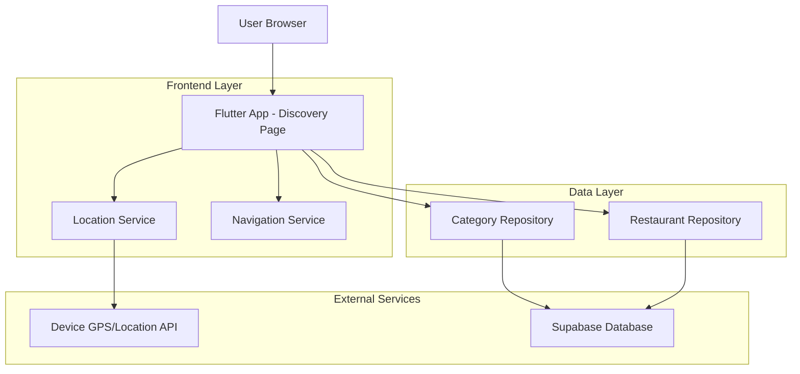
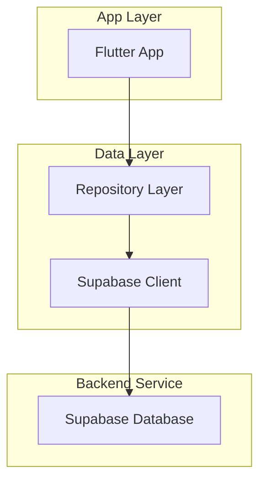
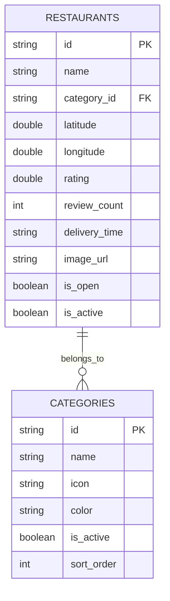

# Arquitetura Técnica - Página de Descoberta de Restaurantes

## 1. Design da Arquitetura



## 2. Descrição das Tecnologias

- Frontend: Flutter@3.x + Dart
- Estado: Riverpod para gerenciamento de estado
- Navegação: GoRouter para roteamento
- Banco de Dados: Supabase (PostgreSQL)
- Geolocalização: geolocator package
- Mapas: flutter_map ou google_maps_flutter

## 3. Definições de Rotas

| Rota | Propósito |
|------|----------|
| /discovery | Página principal de descoberta de restaurantes |
| /discovery/:categoryId | Descoberta filtrada por categoria específica |
| /restaurant/:id | Detalhes do restaurante (rota existente) |

## 4. Definições de API

### 4.1 APIs Principais

**Busca de Restaurantes por Localização e Categoria**
```dart
Future<List<RestaurantModel>> getNearbyRestaurantsByCategory({
  required double latitude,
  required double longitude,
  required String categoryId,
  double radiusKm = 10.0,
  int limit = 20,
})
```

Parâmetros:
| Nome do Parâmetro | Tipo | Obrigatório | Descrição |
|-------------------|------|-------------|-----------|
| latitude | double | true | Latitude da localização atual |
| longitude | double | true | Longitude da localização atual |
| categoryId | string | true | ID da categoria selecionada |
| radiusKm | double | false | Raio de busca em km (padrão: 10) |
| limit | int | false | Limite de resultados (padrão: 20) |

Resposta:
| Nome do Parâmetro | Tipo | Descrição |
|-------------------|------|-----------|
| restaurants | List<RestaurantModel> | Lista de restaurantes encontrados |
| totalCount | int | Total de restaurantes na área |

**Obter Localização Atual**
```dart
Future<Position> getCurrentLocation()
```

Resposta:
| Nome do Parâmetro | Tipo | Descrição |
|-------------------|------|-----------|
| latitude | double | Latitude atual |
| longitude | double | Longitude atual |
| accuracy | double | Precisão da localização |

## 5. Arquitetura do Servidor



## 6. Modelo de Dados

### 6.1 Definição do Modelo de Dados



### 6.2 Linguagem de Definição de Dados

**Tabela de Restaurantes (restaurants)**
```sql
-- Índices para otimizar busca geográfica
CREATE INDEX idx_restaurants_location ON restaurants USING GIST (ST_Point(longitude, latitude));
CREATE INDEX idx_restaurants_category_location ON restaurants(category_id, latitude, longitude);
CREATE INDEX idx_restaurants_active_open ON restaurants(is_active, is_open);

-- Função para busca por distância
CREATE OR REPLACE FUNCTION get_nearby_restaurants_by_category(
    user_lat DOUBLE PRECISION,
    user_lng DOUBLE PRECISION,
    category_filter TEXT,
    radius_km DOUBLE PRECISION DEFAULT 10.0,
    result_limit INTEGER DEFAULT 20
)
RETURNS TABLE (
    id TEXT,
    name TEXT,
    category_id TEXT,
    latitude DOUBLE PRECISION,
    longitude DOUBLE PRECISION,
    rating DOUBLE PRECISION,
    review_count INTEGER,
    delivery_time TEXT,
    image_url TEXT,
    distance_km DOUBLE PRECISION
) AS $$
BEGIN
    RETURN QUERY
    SELECT 
        r.id,
        r.name,
        r.category_id,
        r.latitude,
        r.longitude,
        r.rating,
        r.review_count,
        r.delivery_time,
        r.image_url,
        ST_Distance(
            ST_Point(user_lng, user_lat)::geography,
            ST_Point(r.longitude, r.latitude)::geography
        ) / 1000 AS distance_km
    FROM restaurants r
    WHERE 
        r.is_active = true
        AND r.is_open = true
        AND r.category_id = category_filter
        AND ST_DWithin(
            ST_Point(user_lng, user_lat)::geography,
            ST_Point(r.longitude, r.latitude)::geography,
            radius_km * 1000
        )
    ORDER BY distance_km ASC
    LIMIT result_limit;
END;
$$ LANGUAGE plpgsql;
```

**Permissões Supabase**
```sql
-- Permitir leitura para usuários anônimos
GRANT SELECT ON restaurants TO anon;
GRANT SELECT ON categories TO anon;

-- Permitir acesso completo para usuários autenticados
GRANT ALL PRIVILEGES ON restaurants TO authenticated;
GRANT ALL PRIVILEGES ON categories TO authenticated;

-- Política de segurança para restaurantes ativos
CREATE POLICY "Allow read active restaurants" ON restaurants
    FOR SELECT USING (is_active = true);

-- Política de segurança para categorias ativas
CREATE POLICY "Allow read active categories" ON categories
    FOR SELECT USING (is_active = true);
```