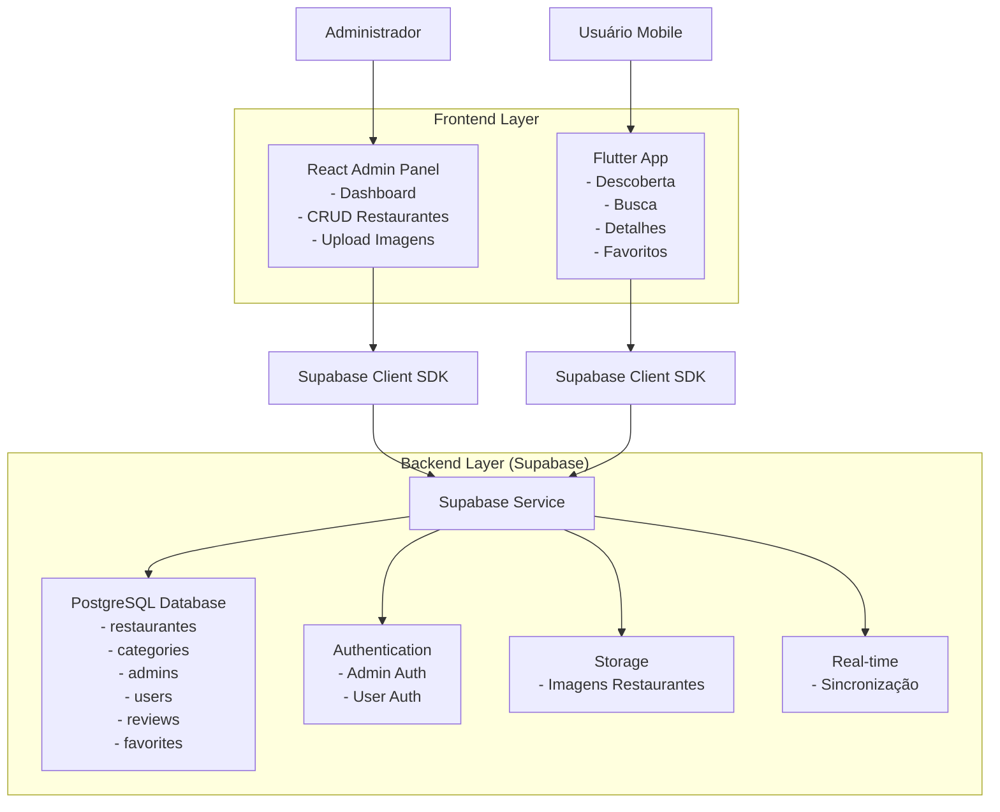
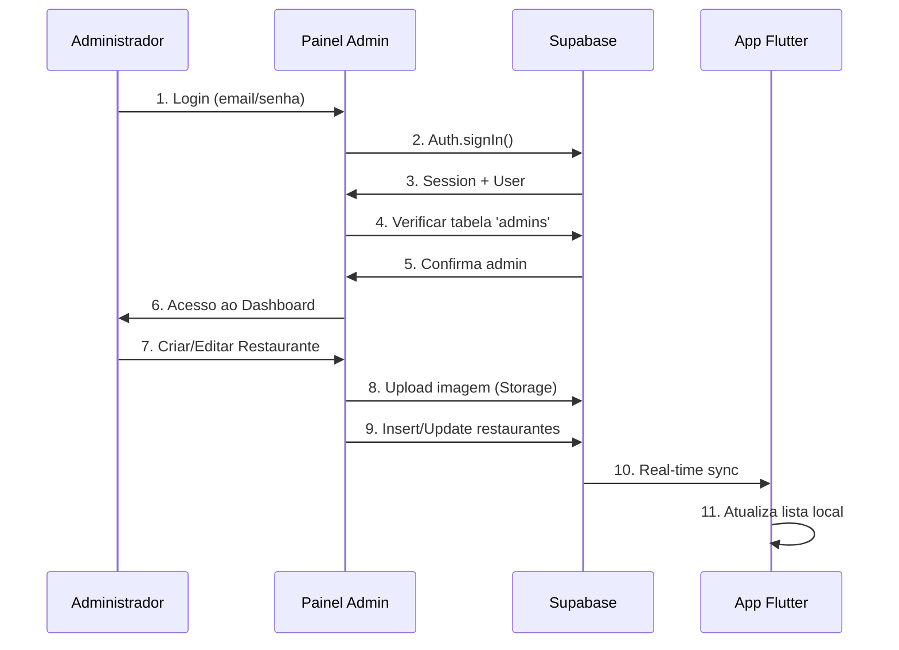
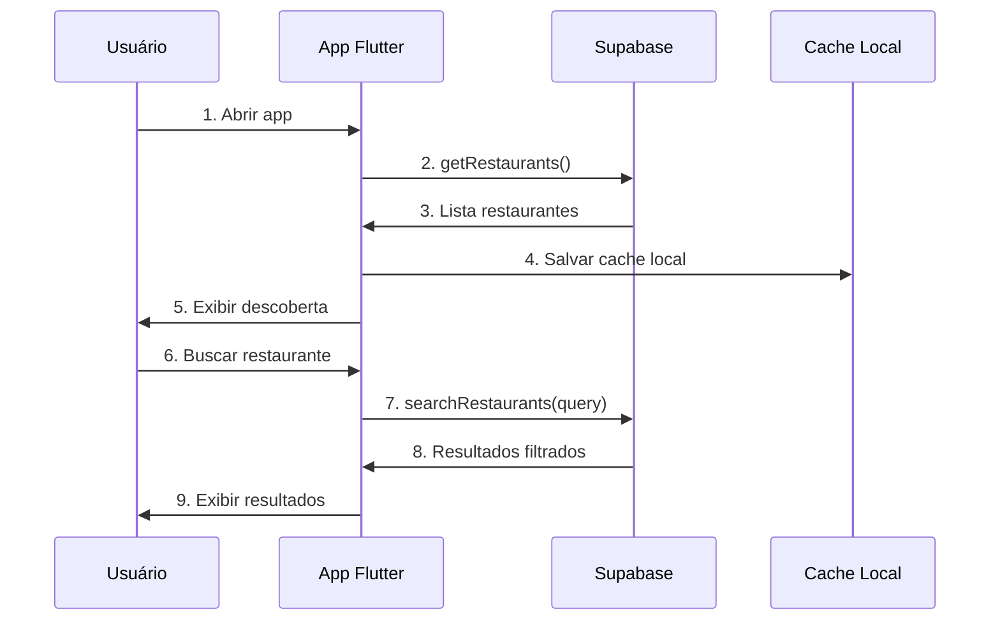
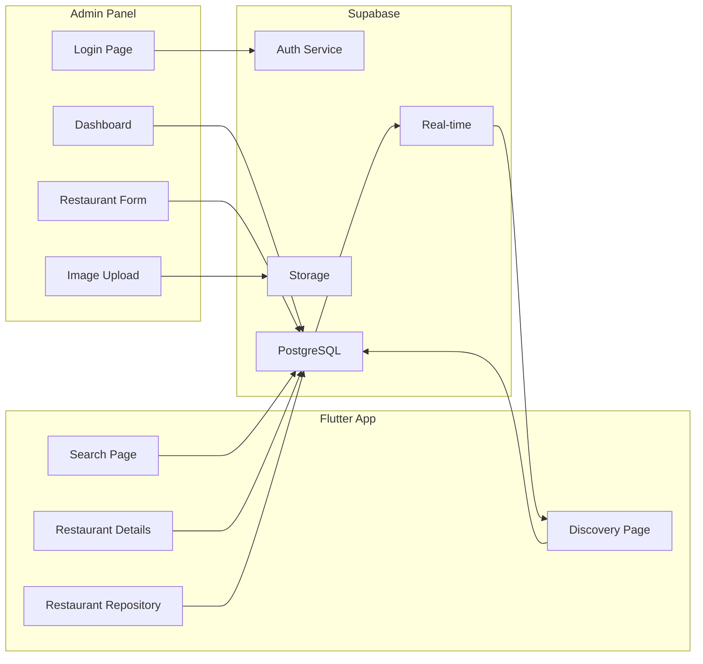
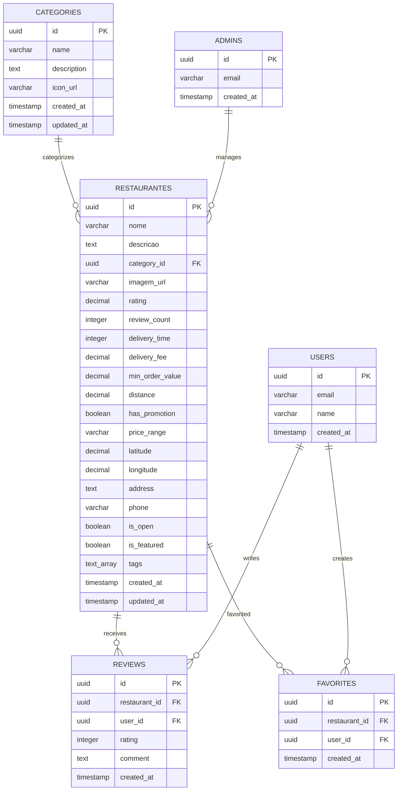

# Documentação Completa do Sistema Taste

## 1. Visão Geral da Arquitetura

### 1.1 Componentes do Sistema

O sistema Taste é composto por dois componentes principais integrados:

- **Painel Administrativo (React/Next.js)**: Interface web para gerenciamento de restaurantes
- **Aplicativo Mobile (Flutter)**: Aplicativo para descoberta e busca de restaurantes
- **Backend Unificado (Supabase)**: PostgreSQL + Auth + Storage + Real-time

### 1.2 Diagrama de Arquitetura Geral



## 2. Fluxo Completo de Dados

### 2.1 Fluxo de Administração



### 2.2 Fluxo de Descoberta (Flutter)



## 3. Páginas e Funcionalidades Implementadas

### 3.1 Painel Administrativo (React)

| Página | Rota | Funcionalidades | Status |
|--------|------|-----------------|--------|
| Login | `/login` | Autenticação admin, validação credenciais | ✅ Implementado |
| Dashboard | `/dashboard` | Lista restaurantes, CRUD completo | ✅ Implementado |
| Acesso Negado | `/acesso-negado` | Página de erro para não-admins | ✅ Implementado |

**Funcionalidades do Dashboard:**
- ✅ Listagem de restaurantes em tabela responsiva
- ✅ Criação de novos restaurantes
- ✅ Edição de restaurantes existentes
- ✅ Exclusão de restaurantes
- ✅ Upload de imagens para Supabase Storage
- ✅ Sistema de tags
- ✅ Validação de formulários
- ✅ Feedback visual (toasts, loading)

### 3.2 Aplicativo Flutter

| Tela | Rota | Funcionalidades | Status |
|------|------|-----------------|--------|
| Descoberta | `/` | Lista restaurantes, categorias | ✅ Implementado |
| Busca | `/search` | Busca por nome, filtros | ✅ Implementado |
| Detalhes | `/restaurant/:id` | Informações completas | ✅ Implementado |
| Favoritos | `/favorites` | Lista de favoritos | ✅ Implementado |
| Perfil | `/profile` | Dados do usuário | ✅ Implementado |

**Funcionalidades da Descoberta:**
- ✅ Carregamento de restaurantes do Supabase
- ✅ Exibição em cards responsivos
- ✅ Filtros por categoria
- ✅ Sistema de ratings
- ✅ Cache local para performance
- ✅ Pull-to-refresh

## 4. APIs e Endpoints

### 4.1 APIs Supabase (PostgreSQL)

#### Restaurantes
```sql
-- Busca com filtros geográficos
CREATE OR REPLACE FUNCTION search_restaurants(
  search_term TEXT DEFAULT NULL,
  category_filter UUID DEFAULT NULL,
  lat DECIMAL DEFAULT NULL,
  lng DECIMAL DEFAULT NULL,
  radius_km INTEGER DEFAULT 10
)
RETURNS TABLE (...)
```

#### Endpoints REST via Supabase Client

| Método | Endpoint | Descrição | Usado Por |
|--------|----------|-----------|----------|
| GET | `/rest/v1/restaurantes` | Listar restaurantes | Flutter, Admin |
| POST | `/rest/v1/restaurantes` | Criar restaurante | Admin |
| PATCH | `/rest/v1/restaurantes?id=eq.{id}` | Atualizar restaurante | Admin |
| DELETE | `/rest/v1/restaurantes?id=eq.{id}` | Deletar restaurante | Admin |
| GET | `/rest/v1/categories` | Listar categorias | Flutter, Admin |
| GET | `/rest/v1/admins` | Verificar admin | Admin |

### 4.2 Storage APIs

| Operação | Endpoint | Descrição |
|----------|----------|----------|
| Upload | `/storage/v1/object/images/{filename}` | Upload de imagens |
| Download | `/storage/v1/object/public/images/{filename}` | Acesso público às imagens |
| Delete | `/storage/v1/object/images/{filename}` | Deletar imagem |

## 5. Configurações de Ambiente e Deployment

### 5.1 Variáveis de Ambiente

#### Painel Administrativo (.env.local)
```env
NEXT_PUBLIC_SUPABASE_URL=https://your-project.supabase.co
NEXT_PUBLIC_SUPABASE_ANON_KEY=your-anon-key
```

#### Aplicativo Flutter (.env)
```env
SUPABASE_URL=https://your-project.supabase.co
SUPABASE_ANON_KEY=your-anon-key
SUPABASE_SERVICE_KEY=your-service-key
GOOGLE_MAPS_API_KEY=your-google-maps-key
```

### 5.2 Configuração Unificada do Supabase

Ambos os projetos utilizam a mesma instância do Supabase:
- **URL**: Idêntica em ambos os projetos
- **Chave Anônima**: Idêntica em ambos os projetos
- **Banco de Dados**: Compartilhado entre admin e app
- **Storage**: Bucket 'images' público para ambos

## 6. Correção do Sistema de Login

### 6.1 Problema Identificado

**Erro**: `Invalid login credentials`

**Causa Raiz**: O usuário administrador não foi criado no Supabase Auth, apenas na tabela `admins`.

### 6.2 Solução Completa

#### Passo 1: Criar Usuário no Supabase Auth
1. Acesse o painel do Supabase
2. Vá para **Authentication > Users**
3. Clique em **Add user**
4. Preencha:
   - **Email**: `admin@gastroapp.com`
   - **Password**: `admin123`
   - **Auto Confirm User**: ✅ Marque
5. Clique em **Create user**

#### Passo 2: Verificar Tabela Admins
```sql
-- Verificar se o admin existe na tabela
SELECT * FROM admins WHERE email = 'admin@gastroapp.com';

-- Se não existir, inserir:
INSERT INTO admins (email) VALUES ('admin@gastroapp.com');
```

#### Passo 3: Verificar Políticas RLS
```sql
-- Verificar se as políticas estão ativas
SELECT schemaname, tablename, policyname, permissive, roles, cmd, qual 
FROM pg_policies 
WHERE tablename IN ('restaurantes', 'admins');
```

### 6.3 Processo de Criação de Novos Administradores

#### Via Painel Supabase (Recomendado)
1. **Authentication > Users**: Criar usuário
2. **SQL Editor**: Adicionar email na tabela `admins`

#### Via SQL (Avançado)
```sql
-- 1. Inserir na tabela admins
INSERT INTO admins (email) VALUES ('novo-admin@exemplo.com');

-- 2. Criar usuário via função (se disponível)
-- Nota: Requer configuração adicional de service role
```

### 6.4 Troubleshooting de Autenticação

| Erro | Causa Provável | Solução |
|------|----------------|----------|
| `Invalid login credentials` | Usuário não existe no Auth | Criar usuário no painel |
| `Access denied` | Email não está na tabela admins | Inserir email na tabela |
| `Session expired` | Token expirado | Fazer logout/login |
| `Network error` | Configuração incorreta | Verificar .env.local |

## 7. Interconexões Entre Componentes

### 7.1 Mapeamento de Conexões



### 7.2 Dependências Críticas

#### Painel Administrativo
- **Supabase Auth**: Autenticação de administradores
- **Tabela admins**: Verificação de permissões
- **Tabela restaurantes**: CRUD de dados
- **Storage images**: Upload de imagens

#### Aplicativo Flutter
- **Tabela restaurantes**: Fonte de dados principal
- **Tabela categories**: Filtros e categorização
- **Storage images**: Exibição de imagens
- **Real-time**: Sincronização automática

### 7.3 Pontos de Integração Críticos

1. **Sincronização de Dados**
   - Admin cria/edita → Real-time → Flutter atualiza
   - Cache local no Flutter para performance

2. **Consistência de Imagens**
   - Upload no admin → URL salva no banco → Flutter carrega
   - Política de storage permite acesso público

3. **Estrutura de Dados Unificada**
   - Modelo expandido no banco
   - Mapeamento no Flutter via `fromSupabase()`
   - Compatibilidade mantida

## 8. Modelo de Dados Completo

### 8.1 Diagrama ER



### 8.2 DDL Completo

```sql
-- Tabela de categorias
CREATE TABLE categories (
  id UUID PRIMARY KEY DEFAULT gen_random_uuid(),
  name VARCHAR(100) NOT NULL,
  description TEXT,
  icon_url VARCHAR(255),
  created_at TIMESTAMP WITH TIME ZONE DEFAULT NOW(),
  updated_at TIMESTAMP WITH TIME ZONE DEFAULT NOW()
);

-- Tabela de restaurantes (expandida)
CREATE TABLE restaurantes (
  id UUID PRIMARY KEY DEFAULT gen_random_uuid(),
  nome VARCHAR(255) NOT NULL,
  descricao TEXT NOT NULL,
  category_id UUID REFERENCES categories(id),
  imagem_url VARCHAR(500),
  rating DECIMAL(2,1) DEFAULT 4.0,
  review_count INTEGER DEFAULT 0,
  delivery_time INTEGER DEFAULT 30,
  delivery_fee DECIMAL(5,2) DEFAULT 5.0,
  min_order_value DECIMAL(6,2) DEFAULT 20.0,
  distance DECIMAL(5,2) DEFAULT 0.0,
  has_promotion BOOLEAN DEFAULT false,
  price_range VARCHAR(10) DEFAULT '$$',
  latitude DECIMAL(10,8) NOT NULL,
  longitude DECIMAL(11,8) NOT NULL,
  address TEXT,
  phone VARCHAR(20),
  is_open BOOLEAN DEFAULT true,
  is_featured BOOLEAN DEFAULT false,
  tags TEXT[] DEFAULT '{}',
  created_at TIMESTAMP WITH TIME ZONE DEFAULT NOW(),
  updated_at TIMESTAMP WITH TIME ZONE DEFAULT NOW()
);

-- Tabela de administradores
CREATE TABLE admins (
  id UUID PRIMARY KEY DEFAULT gen_random_uuid(),
  email VARCHAR(255) UNIQUE NOT NULL,
  created_at TIMESTAMP WITH TIME ZONE DEFAULT NOW()
);

-- Índices para performance
CREATE INDEX idx_restaurantes_category ON restaurantes(category_id);
CREATE INDEX idx_restaurantes_location ON restaurantes(latitude, longitude);
CREATE INDEX idx_restaurantes_rating ON restaurantes(rating DESC);
CREATE INDEX idx_restaurantes_featured ON restaurantes(is_featured);
CREATE INDEX idx_restaurantes_tags ON restaurantes USING GIN(tags);

-- Trigger para updated_at
CREATE OR REPLACE FUNCTION update_updated_at_column()
RETURNS TRIGGER AS $$
BEGIN
    NEW.updated_at = NOW();
    RETURN NEW;
END;
$$ language 'plpgsql';

CREATE TRIGGER update_restaurantes_updated_at 
    BEFORE UPDATE ON restaurantes 
    FOR EACH ROW 
    EXECUTE FUNCTION update_updated_at_column();

CREATE TRIGGER update_categories_updated_at 
    BEFORE UPDATE ON categories 
    FOR EACH ROW 
    EXECUTE FUNCTION update_updated_at_column();
```

### 8.3 Políticas de Segurança (RLS)

```sql
-- Habilitar RLS
ALTER TABLE restaurantes ENABLE ROW LEVEL SECURITY;
ALTER TABLE categories ENABLE ROW LEVEL SECURITY;
ALTER TABLE admins ENABLE ROW LEVEL SECURITY;

-- Políticas para restaurantes
CREATE POLICY "Public can view restaurants" ON restaurantes
    FOR SELECT USING (true);

CREATE POLICY "Admin can manage restaurants" ON restaurantes
    FOR ALL USING (
        auth.role() = 'authenticated' AND 
        auth.jwt() ->> 'email' IN (SELECT email FROM admins)
    );

-- Políticas para categorias
CREATE POLICY "Public can view categories" ON categories
    FOR SELECT USING (true);

CREATE POLICY "Admin can manage categories" ON categories
    FOR ALL USING (
        auth.role() = 'authenticated' AND 
        auth.jwt() ->> 'email' IN (SELECT email FROM admins)
    );

-- Políticas para admins
CREATE POLICY "Admin can view admins" ON admins
    FOR SELECT USING (
        auth.role() = 'authenticated' AND 
        auth.jwt() ->> 'email' IN (SELECT email FROM admins)
    );
```

## 9. Guias de Manutenção

### 9.1 Adicionando Novos Administradores

#### Processo Completo
1. **Criar usuário no Supabase Auth**:
   ```
   Dashboard > Authentication > Users > Add user
   - Email: novo-admin@exemplo.com
   - Password: senha-segura
   - Auto Confirm: ✅
   ```

2. **Adicionar à tabela admins**:
   ```sql
   INSERT INTO admins (email) VALUES ('novo-admin@exemplo.com');
   ```

3. **Verificar acesso**:
   - Testar login no painel
   - Verificar permissões de CRUD

### 9.2 Troubleshooting Comum

#### Problemas de Autenticação
| Sintoma | Diagnóstico | Solução |
|---------|-------------|----------|
| "Invalid credentials" | Usuário não existe | Criar no Auth |
| "Access denied" | Não é admin | Adicionar na tabela |
| "Network error" | Config incorreta | Verificar .env |
| "Session expired" | Token expirado | Logout/login |

#### Problemas de Sincronização
| Sintoma | Diagnóstico | Solução |
|---------|-------------|----------|
| Dados não aparecem no app | Cache desatualizado | Pull-to-refresh |
| Imagem não carrega | URL incorreta | Verificar storage |
| Real-time não funciona | Conexão perdida | Reconectar |

### 9.3 Backup e Recovery

#### Backup Automático (Supabase)
- Backups diários automáticos
- Retenção de 7 dias (plano gratuito)
- Point-in-time recovery disponível

#### Backup Manual
```sql
-- Exportar dados críticos
COPY restaurantes TO '/backup/restaurantes.csv' DELIMITER ',' CSV HEADER;
COPY categories TO '/backup/categories.csv' DELIMITER ',' CSV HEADER;
COPY admins TO '/backup/admins.csv' DELIMITER ',' CSV HEADER;
```

#### Recovery
1. **Via Painel Supabase**: Dashboard > Settings > Database > Restore
2. **Via SQL**: Importar CSVs de backup
3. **Recriar Storage**: Re-upload de imagens se necessário

### 9.4 Procedimentos de Atualização

#### Atualizando o Painel Admin
```bash
# 1. Backup do código atual
git commit -am "Backup antes da atualização"

# 2. Atualizar dependências
npm update

# 3. Testar localmente
npm run dev

# 4. Deploy (se usando Vercel)
npm run build
vercel --prod
```

#### Atualizando o App Flutter
```bash
# 1. Backup
git commit -am "Backup antes da atualização"

# 2. Atualizar dependências
flutter pub upgrade

# 3. Testar
flutter test
flutter run

# 4. Build para produção
flutter build apk --release
```

#### Atualizando Banco de Dados
```sql
-- 1. Backup antes de mudanças
-- 2. Aplicar migrações
-- 3. Testar com dados de exemplo
-- 4. Verificar políticas RLS
-- 5. Testar integração completa
```

## 10. Monitoramento e Logs

### 10.1 Logs do Painel Admin
- **Console do navegador**: Erros de autenticação
- **Network tab**: Falhas de API
- **Supabase Dashboard**: Logs de queries

### 10.2 Logs do Flutter
- **Debug console**: Erros de runtime
- **Supabase logs**: Queries e auth
- **Crash reports**: Via Firebase (se configurado)

### 10.3 Métricas de Performance
- **Supabase Dashboard**: Query performance
- **Storage usage**: Uso do bucket images
- **Auth metrics**: Logins e sessões

---

## ✅ Status Atual do Sistema

- ✅ **Painel Administrativo**: Totalmente funcional
- ✅ **Aplicativo Flutter**: Integrado com dados reais
- ✅ **Base de Dados**: Expandida e otimizada
- ✅ **Sincronização**: Real-time funcionando
- ⚠️ **Autenticação Admin**: Requer criação de usuário
- ✅ **Storage**: Upload e acesso funcionando
- ✅ **Segurança**: RLS configurado

**Próximos Passos Recomendados**:
1. Criar usuário admin no Supabase Auth
2. Implementar sistema de reviews
3. Adicionar notificações push
4. Configurar analytics
5. Implementar testes automatizados