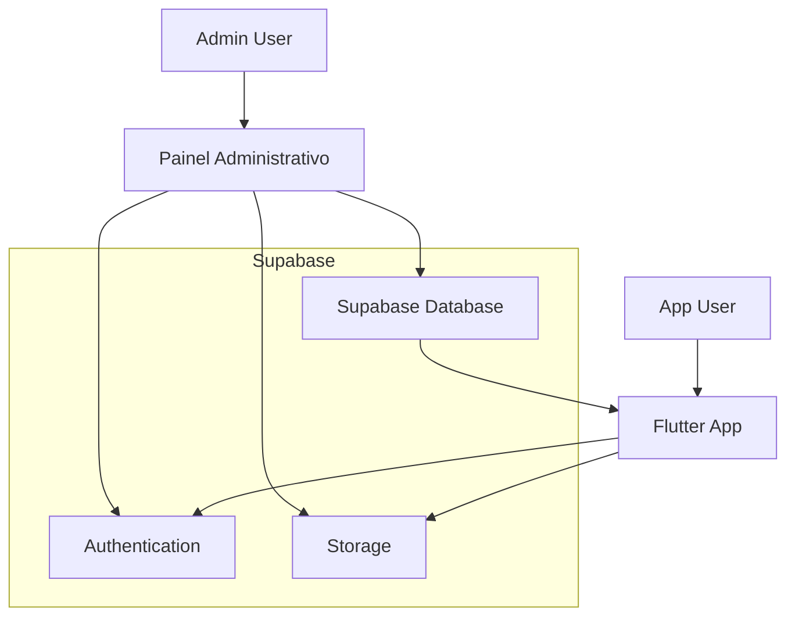

# Integração do Painel Administrativo ao Aplicativo Flutter

## 1. Análise Comparativa das Estruturas de Dados

### 1.1 Estrutura do Painel Administrativo (Tabela 'restaurantes')

O painel administrativo utiliza a seguinte estrutura na tabela `restaurantes` do Supabase:

| Campo | Tipo | Descrição |
|-------|------|----------|
| id | UUID | Identificador único do restaurante |
| nome | VARCHAR | Nome do restaurante |
| tipo | VARCHAR | Tipo/categoria do restaurante |
| descricao | TEXT | Descrição detalhada do restaurante |
| latitude | DECIMAL | Coordenada de latitude |
| longitude | DECIMAL | Coordenada de longitude |
| tags | TEXT[] | Array de tags/palavras-chave |
| imagem_url | VARCHAR | URL da imagem do restaurante |
| created_at | TIMESTAMP | Data de criação |
| updated_at | TIMESTAMP | Data da última atualização |

### 1.2 Estrutura Atual do Flutter (RestaurantModel)

O modelo atual do Flutter possui uma estrutura mais extensa:

```dart
class RestaurantModel {
  final String id;
  final String name;
  final String description;
  final String categoryId;
  final String imageUrl;
  final double rating;
  final int reviewCount;
  final CategoryModel? category;
  final int deliveryTime;
  final double deliveryFee;
  final double minOrderValue;
  final double distance;
  final bool hasPromotion;
  final String priceRange;
  final double latitude;
  final double longitude;
  final String address;
  final String phone;
  final bool isOpen;
  final bool isFeatured;
  final DateTime createdAt;
  final DateTime updatedAt;
}
```

### 1.3 Diferenças e Incompatibilidades

**Campos Presentes no Flutter mas Ausentes no Painel:**
- `rating` (avaliação)
- `reviewCount` (número de avaliações)
- `deliveryTime` (tempo de entrega)
- `deliveryFee` (taxa de entrega)
- `minOrderValue` (valor mínimo do pedido)
- `distance` (distância)
- `hasPromotion` (tem promoção)
- `priceRange` (faixa de preço)
- `address` (endereço)
- `phone` (telefone)
- `isOpen` (está aberto)
- `isFeatured` (é destaque)
- `categoryId` (ID da categoria)

**Campos com Nomenclatura Diferente:**
- `nome` (painel) → `name` (Flutter)
- `tipo` (painel) → `categoryId` (Flutter)
- `imagem_url` (painel) → `imageUrl` (Flutter)

**Campos Únicos do Painel:**
- `tags` (array de tags)

## 2. Estratégia de Integração

### 2.1 Migração dos Dados Mock para Dados Reais

**Fase 1: Preparação da Base de Dados**
1. Expandir a tabela `restaurantes` no Supabase para incluir os campos ausentes
2. Criar tabela `categories` para gerenciar categorias separadamente
3. Migrar dados mock existentes para o Supabase

**Fase 2: Atualização do Modelo de Dados**
1. Manter compatibilidade com o `RestaurantModel` atual
2. Implementar valores padrão para campos ausentes
3. Criar mapeamento entre estruturas

### 2.2 Mapeamento Entre Campos

```dart
// Mapeamento do painel administrativo para Flutter
RestaurantModel.fromSupabase(Map<String, dynamic> data) {
  return RestaurantModel(
    id: data['id'],
    name: data['nome'],
    description: data['descricao'] ?? '',
    categoryId: data['tipo'] ?? '',
    imageUrl: data['imagem_url'] ?? '',
    latitude: data['latitude']?.toDouble() ?? 0.0,
    longitude: data['longitude']?.toDouble() ?? 0.0,
    // Valores padrão para campos ausentes
    rating: 4.0, // Valor padrão
    reviewCount: 0,
    deliveryTime: 30,
    deliveryFee: 5.0,
    minOrderValue: 20.0,
    distance: 0.0,
    hasPromotion: false,
    priceRange: '\$\$',
    address: '', // A ser preenchido posteriormente
    phone: '', // A ser preenchido posteriormente
    isOpen: true,
    isFeatured: false,
    createdAt: DateTime.parse(data['created_at']),
    updatedAt: DateTime.parse(data['updated_at']),
  );
}
```

### 2.3 Configuração Unificada do Supabase

**Verificação de Compatibilidade:**
- Painel administrativo: Utiliza variáveis de ambiente para URL e chave
- Flutter: Já configurado com Supabase
- Ambos devem apontar para a mesma instância do Supabase

**Configuração Recomendada:**
```dart
// supabase_config.dart
class SupabaseConfig {
  static const String supabaseUrl = 'https://your-project.supabase.co';
  static const String supabaseAnonKey = 'your-anon-key';
  
  static Future<void> initialize() async {
    await Supabase.initialize(
      url: supabaseUrl,
      anonKey: supabaseAnonKey,
    );
  }
}
```

## 3. Plano de Implementação

### 3.1 Etapa 1: Preparação da Base de Dados

**Ações:**
1. Expandir tabela `restaurantes` com campos adicionais
2. Criar tabela `categories`
3. Estabelecer relacionamentos entre tabelas
4. Configurar políticas de segurança (RLS)

**DDL Sugerido:**
```sql
-- Expandir tabela restaurantes
ALTER TABLE restaurantes ADD COLUMN IF NOT EXISTS rating DECIMAL(2,1) DEFAULT 4.0;
ALTER TABLE restaurantes ADD COLUMN IF NOT EXISTS review_count INTEGER DEFAULT 0;
ALTER TABLE restaurantes ADD COLUMN IF NOT EXISTS delivery_time INTEGER DEFAULT 30;
ALTER TABLE restaurantes ADD COLUMN IF NOT EXISTS delivery_fee DECIMAL(5,2) DEFAULT 5.0;
ALTER TABLE restaurantes ADD COLUMN IF NOT EXISTS min_order_value DECIMAL(6,2) DEFAULT 20.0;
ALTER TABLE restaurantes ADD COLUMN IF NOT EXISTS distance DECIMAL(5,2) DEFAULT 0.0;
ALTER TABLE restaurantes ADD COLUMN IF NOT EXISTS has_promotion BOOLEAN DEFAULT false;
ALTER TABLE restaurantes ADD COLUMN IF NOT EXISTS price_range VARCHAR(10) DEFAULT '$$';
ALTER TABLE restaurantes ADD COLUMN IF NOT EXISTS address TEXT;
ALTER TABLE restaurantes ADD COLUMN IF NOT EXISTS phone VARCHAR(20);
ALTER TABLE restaurantes ADD COLUMN IF NOT EXISTS is_open BOOLEAN DEFAULT true;
ALTER TABLE restaurantes ADD COLUMN IF NOT EXISTS is_featured BOOLEAN DEFAULT false;
ALTER TABLE restaurantes ADD COLUMN IF NOT EXISTS category_id UUID;

-- Criar tabela categories
CREATE TABLE IF NOT EXISTS categories (
  id UUID PRIMARY KEY DEFAULT gen_random_uuid(),
  name VARCHAR(100) NOT NULL,
  description TEXT,
  icon_url VARCHAR(255),
  created_at TIMESTAMP WITH TIME ZONE DEFAULT NOW(),
  updated_at TIMESTAMP WITH TIME ZONE DEFAULT NOW()
);

-- Adicionar foreign key
ALTER TABLE restaurantes ADD CONSTRAINT fk_category 
  FOREIGN KEY (category_id) REFERENCES categories(id);
```

### 3.2 Etapa 2: Atualização do Modelo de Dados

**Ações:**
1. Atualizar `RestaurantModel` para suportar dados do Supabase
2. Criar método `fromSupabase` para conversão
3. Manter compatibilidade com dados mock durante transição

### 3.3 Etapa 3: Atualização dos Repositórios

**Modificações no `RestaurantRepository`:**
```dart
class RestaurantRepository {
  final SupabaseClient _supabase = Supabase.instance.client;
  
  Future<List<RestaurantModel>> getRestaurants() async {
    try {
      final response = await _supabase
          .from('restaurantes')
          .select('*, categories(*)')
          .order('created_at', ascending: false);
      
      return (response as List)
          .map((data) => RestaurantModel.fromSupabase(data))
          .toList();
    } catch (e) {
      throw Exception('Erro ao buscar restaurantes: $e');
    }
  }
  
  Future<RestaurantModel?> getRestaurantById(String id) async {
    try {
      final response = await _supabase
          .from('restaurantes')
          .select('*, categories(*)')
          .eq('id', id)
          .single();
      
      return RestaurantModel.fromSupabase(response);
    } catch (e) {
      return null;
    }
  }
}
```

### 3.4 Etapa 4: Atualização dos Serviços

**Modificações no `SearchService`:**
- Implementar busca real no Supabase
- Utilizar busca por texto completo
- Implementar filtros por categoria e localização

### 3.5 Etapa 5: Testes e Validação

**Testes Unitários:**
1. Testar conversão de dados do Supabase
2. Testar repositórios com dados reais
3. Testar serviços de busca

**Testes de Integração:**
1. Testar fluxo completo de dados
2. Validar performance com dados reais
3. Testar sincronização entre painel e app

## 4. Documentação da Nova Arquitetura

### 4.1 Visão Geral da Integração



### 4.2 Fluxo de Dados

**Criação/Edição de Restaurantes:**
1. Admin acessa painel administrativo
2. Admin autentica via Supabase Auth
3. Admin cria/edita restaurante
4. Dados são salvos na tabela `restaurantes`
5. Imagens são enviadas para Supabase Storage
6. App Flutter consome dados atualizados em tempo real

**Consumo no App:**
1. App Flutter autentica usuário (se necessário)
2. App consulta tabela `restaurantes` via Supabase Client
3. Dados são convertidos para `RestaurantModel`
4. Interface é atualizada com dados reais

### 4.3 Considerações de Segurança

**Row Level Security (RLS):**
```sql
-- Política para leitura pública de restaurantes
CREATE POLICY "Restaurantes são visíveis para todos" ON restaurantes
  FOR SELECT USING (true);

-- Política para admin modificar restaurantes
CREATE POLICY "Apenas admins podem modificar restaurantes" ON restaurantes
  FOR ALL USING (auth.jwt() ->> 'role' = 'admin');
```

**Autenticação:**
- Painel administrativo: Requer autenticação de admin
- App Flutter: Permite acesso anônimo para visualização
- Operações sensíveis requerem autenticação

### 4.4 Considerações de Performance

**Otimizações:**
1. Implementar cache local no Flutter
2. Usar paginação para listas grandes
3. Implementar lazy loading de imagens
4. Configurar índices apropriados no banco

**Monitoramento:**
1. Acompanhar tempo de resposta das queries
2. Monitorar uso de bandwidth
3. Implementar logs de erro

### 4.5 Próximos Passos

**Melhorias Futuras:**
1. Implementar sincronização offline
2. Adicionar sistema de reviews e ratings
3. Implementar notificações push
4. Adicionar analytics de uso

**Manutenção:**
1. Backup regular da base de dados
2. Monitoramento de performance
3. Atualizações de segurança
4. Documentação de APIs

## 5. Conclusão

A integração do painel administrativo ao aplicativo Flutter através do Supabase proporcionará:

- **Centralização de dados**: Fonte única de verdade para informações de restaurantes
- **Facilidade de manutenção**: Interface administrativa intuitiva
- **Escalabilidade**: Arquitetura preparada para crescimento
- **Segurança**: Controle de acesso baseado em roles
- **Performance**: Otimizações para experiência do usuário

Esta integração estabelece uma base sólida para o crescimento e evolução contínua da plataforma Taste.