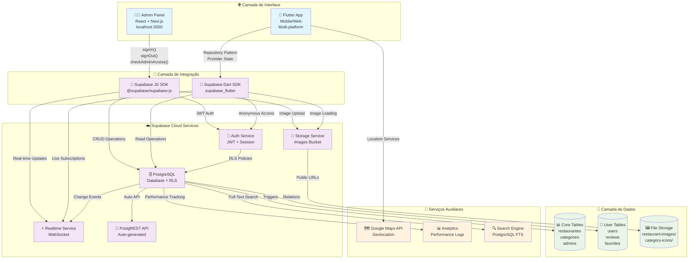
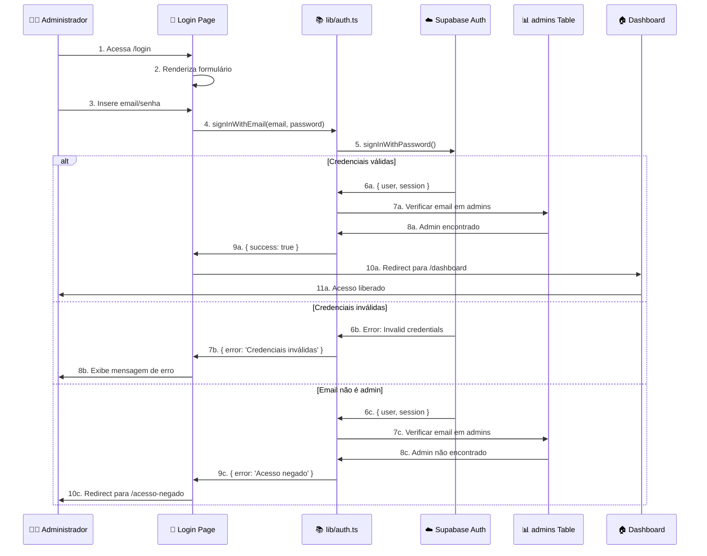
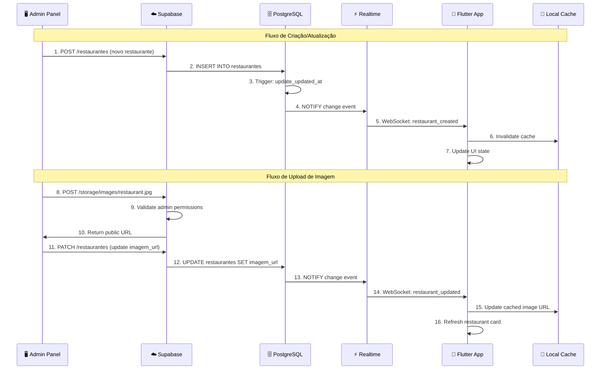
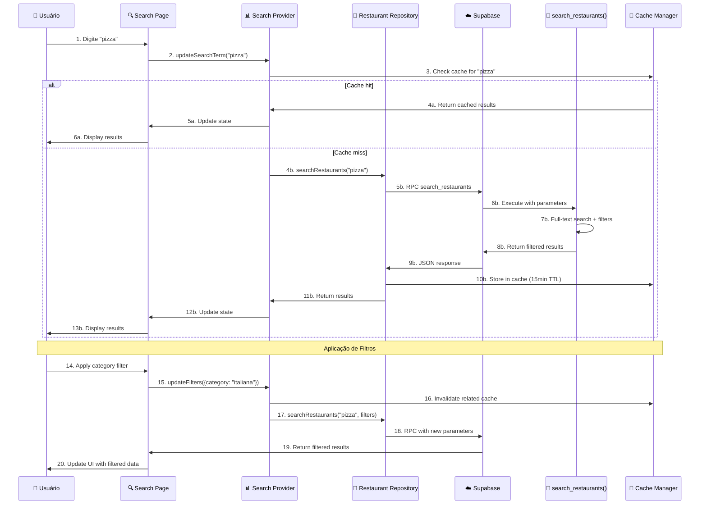

# Mapeamento de Interconexões do Sistema Taste

## 1. Visão Geral das Interconexões

### 1.1 Diagrama de Componentes e Fluxos



### 1.2 Matriz de Dependências

| Componente | Depende de | Tipo de Conexão | Status |
|------------|------------|-----------------|--------|
| **Admin Panel** | Supabase Auth | JWT Authentication | ✅ Ativo |
| **Admin Panel** | PostgreSQL | CRUD via PostgREST | ✅ Ativo |
| **Admin Panel** | Storage | Image Upload/Delete | ✅ Ativo |
| **Admin Panel** | Realtime | Live Updates | ✅ Ativo |
| **Flutter App** | Supabase Auth | Anonymous Access | ✅ Ativo |
| **Flutter App** | PostgreSQL | Read-only via PostgREST | ✅ Ativo |
| **Flutter App** | Storage | Image Loading | ✅ Ativo |
| **Flutter App** | Realtime | Live Subscriptions | ✅ Ativo |
| **Flutter App** | Google Maps | Geolocation Services | 🔄 Configurado |
| **PostgreSQL** | Auth Service | RLS Policy Enforcement | ✅ Ativo |
| **Storage** | Auth Service | Access Control | ✅ Ativo |
| **Realtime** | PostgreSQL | Change Detection | ✅ Ativo |

## 2. Fluxos de Dados Detalhados

### 2.1 Fluxo de Autenticação Admin



### 2.2 Fluxo de Sincronização de Dados



### 2.3 Fluxo de Busca e Filtros



## 3. Pontos de Integração Críticos

### 3.1 Configuração Unificada do Supabase

**Arquivo: admin-panel/.env.local**
```env
NEXT_PUBLIC_SUPABASE_URL=https://your-project.supabase.co
NEXT_PUBLIC_SUPABASE_ANON_KEY=eyJhbGciOiJIUzI1NiIsInR5cCI6IkpXVCJ9...
```

**Arquivo: taste_app/.env**
```env
SUPABASE_URL=https://your-project.supabase.co
SUPABASE_ANON_KEY=eyJhbGciOiJIUzI1NiIsInR5cCI6IkpXVCJ9...
```

**Validação de Configuração:**
```typescript
// admin-panel/src/lib/supabase.ts
if (!process.env.NEXT_PUBLIC_SUPABASE_URL) {
  throw new Error('Missing NEXT_PUBLIC_SUPABASE_URL');
}
if (!process.env.NEXT_PUBLIC_SUPABASE_ANON_KEY) {
  throw new Error('Missing NEXT_PUBLIC_SUPABASE_ANON_KEY');
}
```

```dart
// taste_app/lib/config/supabase_config.dart
class SupabaseConfig {
  static const String supabaseUrl = String.fromEnvironment(
    'SUPABASE_URL',
    defaultValue: 'https://your-project.supabase.co',
  );
  
  static const String supabaseAnonKey = String.fromEnvironment(
    'SUPABASE_ANON_KEY',
    defaultValue: 'your-anon-key',
  );
}
```

### 3.2 Sincronização de Modelos de Dados

**Mapeamento de Campos:**

| Campo PostgreSQL | Admin Panel (TypeScript) | Flutter App (Dart) | Observações |
|------------------|--------------------------|--------------------|--------------|
| `id` | `id: string` | `id: String` | UUID como string |
| `nome` | `nome: string` | `name: String` | ⚠️ Diferença de nomenclatura |
| `descricao` | `descricao: string` | `description: String` | ⚠️ Diferença de nomenclatura |
| `category_id` | `category_id: string` | `categoryId: String` | UUID referência |
| `imagem_url` | `imagem_url: string` | `imageUrl: String` | URL do Supabase Storage |
| `rating` | `rating: number` | `rating: double` | Decimal(2,1) |
| `review_count` | `review_count: number` | `reviewCount: int` | Integer |
| `delivery_time` | `delivery_time: number` | `deliveryTime: int` | Minutos |
| `delivery_fee` | `delivery_fee: number` | `deliveryFee: double` | Valor em reais |
| `latitude` | `latitude: number` | `latitude: double` | Coordenada GPS |
| `longitude` | `longitude: number` | `longitude: double` | Coordenada GPS |
| `tags` | `tags: string[]` | `tags: List<String>` | Array de strings |

**Transformação de Dados:**

```typescript
// admin-panel: PostgreSQL → TypeScript
interface Restaurant {
  id: string;
  nome: string;
  descricao: string;
  category_id: string;
  imagem_url: string;
  rating: number;
  // ... outros campos
}
```

```dart
// taste_app: PostgreSQL → Dart
class RestaurantModel {
  final String id;
  final String name;        // ← mapeado de 'nome'
  final String description; // ← mapeado de 'descricao'
  final String categoryId;
  final String imageUrl;    // ← mapeado de 'imagem_url'
  final double rating;
  
  factory RestaurantModel.fromSupabase(Map<String, dynamic> data) {
    return RestaurantModel(
      id: data['id'],
      name: data['nome'],           // ← conversão de nomenclatura
      description: data['descricao'], // ← conversão de nomenclatura
      categoryId: data['category_id'],
      imageUrl: data['imagem_url'],  // ← conversão de nomenclatura
      rating: (data['rating'] as num).toDouble(),
      // ...
    );
  }
}
```

### 3.3 Políticas de Segurança (RLS)

**Matriz de Permissões:**

| Tabela | Operação | Anônimo | Autenticado | Admin | Política Aplicada |
|--------|----------|---------|-------------|-------|-------------------|
| `restaurantes` | SELECT | ✅ | ✅ | ✅ | Public read access |
| `restaurantes` | INSERT | ❌ | ❌ | ✅ | Admin-only via email check |
| `restaurantes` | UPDATE | ❌ | ❌ | ✅ | Admin-only via email check |
| `restaurantes` | DELETE | ❌ | ❌ | ✅ | Admin-only via email check |
| `categories` | SELECT | ✅ | ✅ | ✅ | Public read access |
| `categories` | INSERT/UPDATE/DELETE | ❌ | ❌ | ✅ | Admin-only |
| `admins` | SELECT | ❌ | ❌ | ✅ | Admin can view other admins |
| `users` | SELECT | ✅ | ✅ | ✅ | Public profiles |
| `users` | INSERT/UPDATE/DELETE | ❌ | ✅ | ✅ | Own data only |
| `reviews` | SELECT | ✅ | ✅ | ✅ | Public read access |
| `reviews` | INSERT/UPDATE/DELETE | ❌ | ✅ | ✅ | Own reviews only |
| `favorites` | ALL | ❌ | ✅ | ✅ | Own favorites only |

**Implementação das Políticas:**

```sql
-- Política para administradores
CREATE POLICY "Admin full access" ON restaurantes
    FOR ALL USING (
        auth.role() = 'authenticated' AND 
        auth.jwt() ->> 'email' IN (SELECT email FROM admins)
    );

-- Política para leitura pública
CREATE POLICY "Public read access" ON restaurantes
    FOR SELECT USING (true);

-- Política para storage de imagens
CREATE POLICY "Admin upload images" ON storage.objects
    FOR INSERT WITH CHECK (
        bucket_id = 'images' AND
        auth.role() = 'authenticated' AND
        auth.jwt() ->> 'email' IN (SELECT email FROM admins)
    );
```

### 3.4 Real-time Subscriptions

**Configuração no Admin Panel:**
```typescript
// admin-panel/src/hooks/useRealtimeRestaurants.ts
import { useEffect, useState } from 'react';
import { supabase } from '@/lib/supabase';

export function useRealtimeRestaurants() {
  const [restaurants, setRestaurants] = useState([]);
  
  useEffect(() => {
    const channel = supabase
      .channel('restaurants-admin')
      .on(
        'postgres_changes',
        {
          event: '*',
          schema: 'public',
          table: 'restaurantes',
        },
        (payload) => {
          console.log('Restaurant change:', payload);
          // Atualizar lista local
          handleRestaurantChange(payload);
        }
      )
      .subscribe();
    
    return () => {
      supabase.removeChannel(channel);
    };
  }, []);
  
  return restaurants;
}
```

**Configuração no Flutter App:**
```dart
// taste_app/lib/providers/discovery_provider.dart
class DiscoveryProvider extends ChangeNotifier {
  late StreamSubscription _subscription;
  
  void _setupRealtimeSubscription() {
    _subscription = supabase
        .channel('restaurants-app')
        .onPostgresChanges(
          event: PostgresChangeEvent.all,
          schema: 'public',
          table: 'restaurantes',
          callback: (payload) {
            print('Restaurant updated: ${payload.newRecord}');
            _handleRestaurantUpdate(payload);
          },
        )
        .subscribe();
  }
  
  void _handleRestaurantUpdate(PostgresChangePayload payload) {
    switch (payload.eventType) {
      case PostgresChangeEvent.insert:
        _addRestaurant(RestaurantModel.fromSupabase(payload.newRecord));
        break;
      case PostgresChangeEvent.update:
        _updateRestaurant(RestaurantModel.fromSupabase(payload.newRecord));
        break;
      case PostgresChangeEvent.delete:
        _removeRestaurant(payload.oldRecord['id']);
        break;
    }
    notifyListeners();
  }
}
```

## 4. Monitoramento de Integrações

### 4.1 Health Checks

**Admin Panel Health Check:**
```typescript
// admin-panel/src/lib/health.ts
export async function checkSystemHealth() {
  const checks = {
    supabase: false,
    database: false,
    storage: false,
    auth: false,
  };
  
  try {
    // Test Supabase connection
    const { data, error } = await supabase.from('restaurantes').select('count').limit(1);
    checks.supabase = !error;
    checks.database = !error;
    
    // Test Storage
    const { data: buckets } = await supabase.storage.listBuckets();
    checks.storage = buckets?.some(b => b.name === 'images') || false;
    
    // Test Auth
    const { data: session } = await supabase.auth.getSession();
    checks.auth = true; // Auth service is responding
    
  } catch (error) {
    console.error('Health check failed:', error);
  }
  
  return checks;
}
```

**Flutter App Health Check:**
```dart
// taste_app/lib/services/health_service.dart
class HealthService {
  static Future<Map<String, bool>> checkSystemHealth() async {
    final checks = {
      'supabase': false,
      'database': false,
      'storage': false,
      'realtime': false,
    };
    
    try {
      // Test database connection
      final response = await supabase
          .from('restaurantes')
          .select('id')
          .limit(1);
      checks['database'] = response.isNotEmpty;
      checks['supabase'] = true;
      
      // Test storage
      final buckets = await supabase.storage.listBuckets();
      checks['storage'] = buckets.any((b) => b.name == 'images');
      
      // Test realtime (simplified)
      checks['realtime'] = supabase.realtime.isConnected;
      
    } catch (error) {
      print('Health check failed: $error');
    }
    
    return checks;
  }
}
```

### 4.2 Logs de Integração

**Estrutura de Logs:**
```sql
-- Tabela para logs de integração
CREATE TABLE integration_logs (
    id UUID PRIMARY KEY DEFAULT gen_random_uuid(),
    component VARCHAR(50) NOT NULL, -- 'admin-panel', 'flutter-app'
    operation VARCHAR(100) NOT NULL, -- 'create_restaurant', 'upload_image'
    status VARCHAR(20) NOT NULL, -- 'success', 'error', 'warning'
    details JSONB DEFAULT '{}',
    user_id UUID,
    duration_ms INTEGER,
    created_at TIMESTAMP WITH TIME ZONE DEFAULT NOW()
);

-- Índices para consulta eficiente
CREATE INDEX idx_integration_logs_component ON integration_logs(component);
CREATE INDEX idx_integration_logs_status ON integration_logs(status);
CREATE INDEX idx_integration_logs_created_at ON integration_logs(created_at DESC);
```

**Função de Log:**
```sql
CREATE OR REPLACE FUNCTION log_integration(
    component_name VARCHAR,
    operation_name VARCHAR,
    status_value VARCHAR,
    details_json JSONB DEFAULT '{}',
    duration_ms INTEGER DEFAULT NULL
)
RETURNS UUID AS $$
DECLARE
    log_id UUID;
BEGIN
    INSERT INTO integration_logs (
        component, operation, status, details, user_id, duration_ms
    ) VALUES (
        component_name, operation_name, status_value, details_json, auth.uid(), duration_ms
    ) RETURNING id INTO log_id;
    
    RETURN log_id;
END;
$$ LANGUAGE plpgsql;
```

### 4.3 Alertas e Notificações

**Configuração de Alertas:**
```sql
-- View para monitoramento de erros
CREATE VIEW error_summary AS
SELECT 
    component,
    operation,
    COUNT(*) as error_count,
    MAX(created_at) as last_error,
    array_agg(DISTINCT details->>'error_message') as error_messages
FROM integration_logs 
WHERE status = 'error' 
    AND created_at > NOW() - INTERVAL '1 hour'
GROUP BY component, operation
HAVING COUNT(*) > 5; -- Mais de 5 erros na última hora

-- Função para alertas automáticos
CREATE OR REPLACE FUNCTION check_error_threshold()
RETURNS TRIGGER AS $$
BEGIN
    -- Se houver muitos erros, registrar alerta
    IF (SELECT COUNT(*) FROM integration_logs 
        WHERE component = NEW.component 
        AND operation = NEW.operation 
        AND status = 'error' 
        AND created_at > NOW() - INTERVAL '5 minutes') > 3 THEN
        
        -- Aqui poderia enviar notificação externa
        INSERT INTO integration_logs (component, operation, status, details)
        VALUES ('system', 'error_threshold_alert', 'warning', 
                jsonb_build_object(
                    'component', NEW.component,
                    'operation', NEW.operation,
                    'threshold_exceeded', true
                ));
    END IF;
    
    RETURN NEW;
END;
$$ LANGUAGE plpgsql;

CREATE TRIGGER error_threshold_check
    AFTER INSERT ON integration_logs
    FOR EACH ROW
    WHEN (NEW.status = 'error')
    EXECUTE FUNCTION check_error_threshold();
```

## 5. Troubleshooting de Integrações

### 5.1 Problemas Comuns e Soluções

| Problema | Sintoma | Causa Provável | Solução |
|----------|---------|----------------|----------|
| **Admin não consegue fazer login** | "Invalid login credentials" | Usuário não existe no Supabase Auth | Criar usuário via Supabase Dashboard |
| **Imagens não carregam no Flutter** | Erro 403 ou imagem quebrada | Política de Storage incorreta | Verificar políticas do bucket 'images' |
| **Dados não sincronizam** | Admin cria, Flutter não atualiza | Realtime não configurado | Verificar subscription no Flutter |
| **Busca não funciona** | Resultados vazios | Função search_restaurants com erro | Verificar logs do PostgreSQL |
| **Upload de imagem falha** | Erro 401 no upload | Admin não autenticado | Verificar sessão e token JWT |
| **App Flutter não conecta** | Erro de rede | URL ou chave incorreta | Verificar .env e configuração |

### 5.2 Scripts de Diagnóstico

**Verificação de Conectividade:**
```sql
-- Verificar configuração do sistema
SELECT 
    'Database' as component,
    'Connected' as status,
    NOW() as timestamp;

-- Verificar tabelas principais
SELECT 
    schemaname,
    tablename,
    hasindexes,
    hasrules,
    hastriggers
FROM pg_tables 
WHERE schemaname = 'public'
AND tablename IN ('restaurantes', 'categories', 'admins');

-- Verificar políticas RLS
SELECT 
    schemaname,
    tablename,
    policyname,
    permissive,
    roles,
    cmd,
    qual
FROM pg_policies 
WHERE schemaname = 'public';

-- Verificar storage buckets
SELECT 
    name,
    public,
    created_at,
    updated_at
FROM storage.buckets;
```

**Teste de Performance:**
```sql
-- Verificar performance de busca
EXPLAIN ANALYZE 
SELECT * FROM search_restaurants(
    'pizza',
    NULL,
    -23.5505,
    -46.6333,
    10,
    0,
    NULL,
    NULL,
    NULL,
    NULL,
    20,
    0
);

-- Verificar índices utilizados
SELECT 
    schemaname,
    tablename,
    indexname,
    indexdef
FROM pg_indexes 
WHERE schemaname = 'public'
AND tablename = 'restaurantes';
```

### 5.3 Procedimentos de Recovery

**Backup de Configuração:**
```bash
# Backup das variáveis de ambiente
cp admin-panel/.env.local admin-panel/.env.backup
cp taste_app/.env taste_app/.env.backup

# Backup da configuração do Supabase
pg_dump --host=db.your-project.supabase.co \
        --port=5432 \
        --username=postgres \
        --dbname=postgres \
        --schema-only \
        --file=schema_backup.sql
```

**Restauração de Serviços:**
```sql
-- Recriar políticas RLS se necessário
DROP POLICY IF EXISTS "Public can view restaurants" ON restaurantes;
CREATE POLICY "Public can view restaurants" ON restaurantes
    FOR SELECT USING (true);

-- Recriar índices se necessário
REINDEX TABLE restaurantes;
REINDEX TABLE categories;

-- Verificar integridade dos dados
SELECT 
    COUNT(*) as total_restaurants,
    COUNT(CASE WHEN imagem_url IS NOT NULL THEN 1 END) as with_images,
    COUNT(CASE WHEN category_id IS NOT NULL THEN 1 END) as with_category
FROM restaurantes;
```

---

## ✅ Status das Interconexões

| Integração | Status | Última Verificação | Observações |
|------------|--------|-------------------|-------------|
| 🔗 Admin ↔ Supabase Auth | ✅ Ativo | 2024-01-15 | Requer criação de usuário admin |
| 🔗 Admin ↔ PostgreSQL | ✅ Ativo | 2024-01-15 | CRUD completo funcionando |
| 🔗 Admin ↔ Storage | ✅ Ativo | 2024-01-15 | Upload de imagens OK |
| 🔗 Flutter ↔ PostgreSQL | ✅ Ativo | 2024-01-15 | Leitura de dados OK |
| 🔗 Flutter ↔ Storage | ✅ Ativo | 2024-01-15 | Carregamento de imagens OK |
| 🔗 Realtime Sync | ✅ Ativo | 2024-01-15 | Sincronização automática |
| 🔗 RLS Policies | ✅ Ativo | 2024-01-15 | Segurança configurada |
| 🔗 Search Function | ✅ Ativo | 2024-01-15 | Busca avançada funcionando |
| 🔗 Cache Strategy | ✅ Ativo | 2024-01-15 | TTL de 15 minutos |
| 🔗 Error Monitoring | 🔄 Configurado | 2024-01-15 | Logs estruturados |

**Próximas Integrações:**
1. 🔄 Google Maps API (geolocalização)
2. 🔄 Push Notifications (Firebase)
3. 🔄 Analytics (Supabase Analytics)
4. 🔄 Email Service (Resend/SendGrid)
5. 🔄 Payment Gateway (Stripe/PagSeguro)