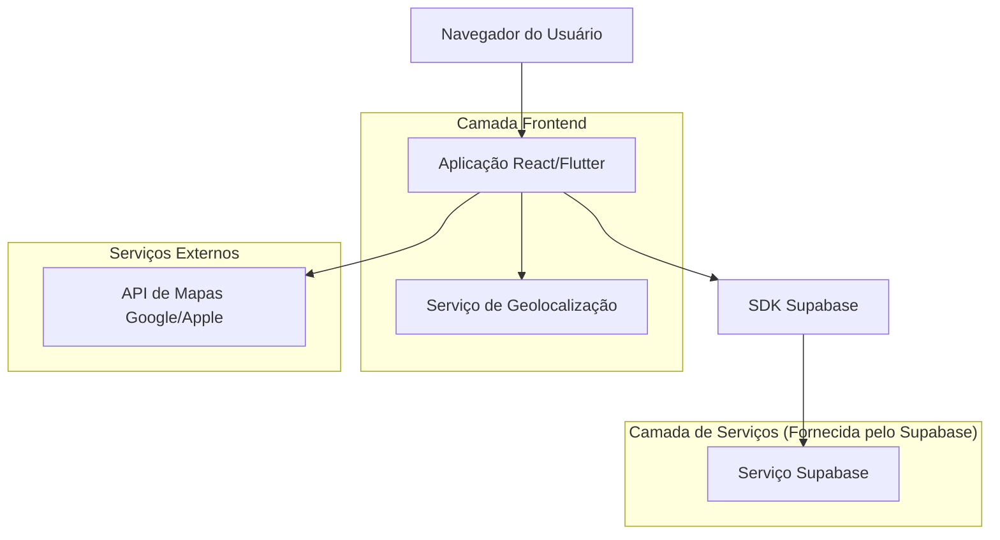
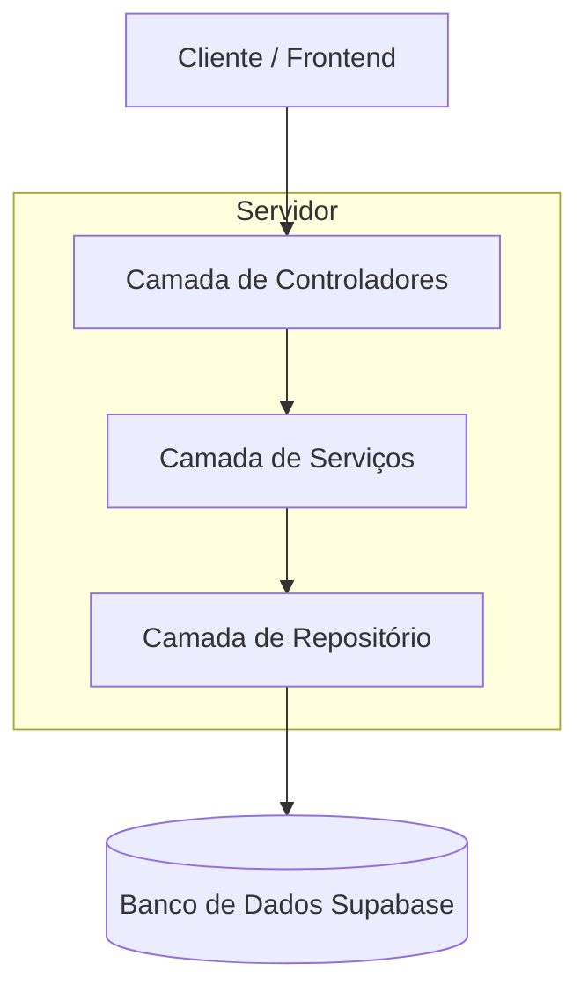
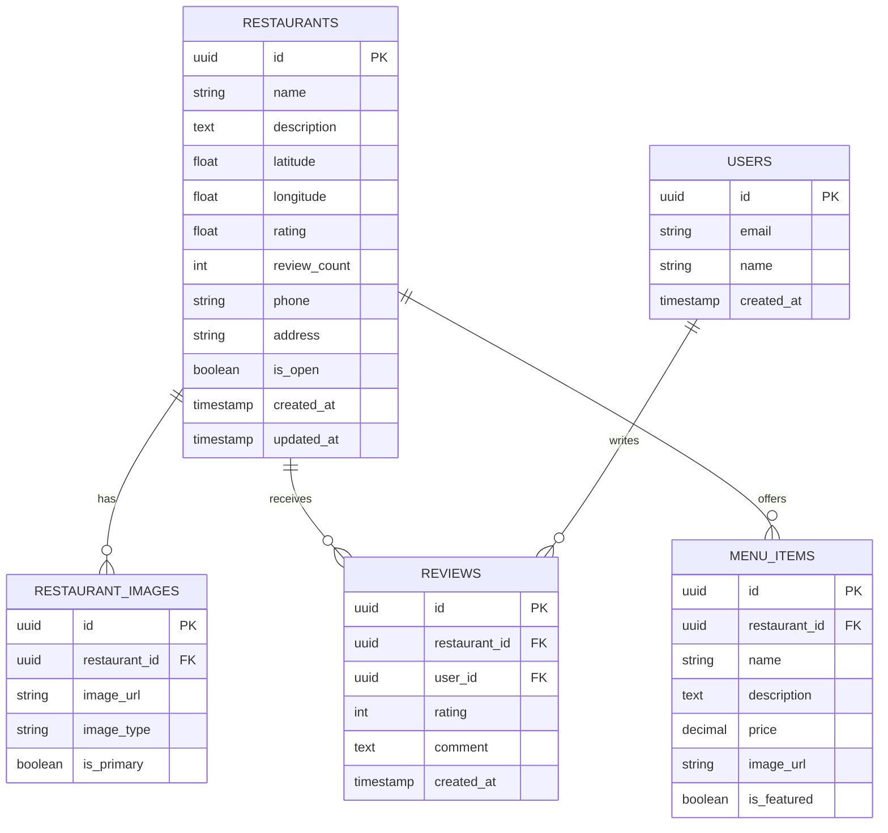

# Arquitetura Técnica - Página Descubra

## 1. Design da Arquitetura



## 2. Descrição da Tecnologia

* Frontend: Flutter/Dart + Provider/Riverpod para gerenciamento de estado

* Backend: Supabase (PostgreSQL + Auth + Storage)

* Mapas: Google Maps SDK (Android) / Apple Maps (iOS)

* Geolocalização: Plugin nativo do Flutter (geolocator)

## 3. Definições de Rotas

| Rota                      | Propósito                                                       |
| ------------------------- | --------------------------------------------------------------- |
| /descubra                 | Página principal de descoberta com mapa e lista de restaurantes |
| /descubra/restaurante/:id | Detalhes de um restaurante específico                           |
| /mapa                     | Visualização em mapa completo                                   |
| /perfil                   | Página de perfil do usuário                                     |

## 4. Definições de API

### 4.1 APIs Principais

**Buscar restaurantes próximos**

```
GET /api/restaurants/nearby
```

Request:

| Nome do Parâmetro | Tipo   | Obrigatório | Descrição                                |
| ----------------- | ------ | ----------- | ---------------------------------------- |
| latitude          | double | true        | Latitude da localização atual            |
| longitude         | double | true        | Longitude da localização atual           |
| radius            | int    | false       | Raio de busca em metros (padrão: 5000)   |
| limit             | int    | false       | Número máximo de resultados (padrão: 20) |

Response:

| Nome do Parâmetro | Tipo    | Descrição                                |
| ----------------- | ------- | ---------------------------------------- |
| restaurants       | array   | Lista de restaurantes encontrados        |
| total             | int     | Total de restaurantes na área            |
| hasMore           | boolean | Indica se há mais resultados disponíveis |

Exemplo:

```json
{
  "restaurants": [
    {
      "id": "rest_123",
      "name": "Nome do restaurante",
      "rating": 4.7,
      "description": "Breve descrição (resumo do perfil)",
      "latitude": -30.0346,
      "longitude": -51.2177,
      "imageUrl": "https://...",
      "distance": 250
    }
  ],
  "total": 15,
  "hasMore": false
}
```

**Obter detalhes do restaurante**

```
GET /api/restaurants/:id
```

Request:

| Nome do Parâmetro | Tipo   | Obrigatório | Descrição               |
| ----------------- | ------ | ----------- | ----------------------- |
| id                | string | true        | ID único do restaurante |

Response:

| Nome do Parâmetro | Tipo   | Descrição                      |
| ----------------- | ------ | ------------------------------ |
| restaurant        | object | Dados completos do restaurante |
| menu              | array  | Pratos em destaque             |
| reviews           | array  | Avaliações recentes            |

## 5. Arquitetura do Servidor



## 6. Modelo de Dados

### 6.1 Definição do Modelo de Dados



### 6.2 Linguagem de Definição de Dados

**Tabela de Restaurantes (restaurants)**

```sql
-- criar tabela
CREATE TABLE restaurants (
    id UUID PRIMARY KEY DEFAULT gen_random_uuid(),
    name VARCHAR(255) NOT NULL,
    description TEXT,
    latitude DECIMAL(10, 8) NOT NULL,
    longitude DECIMAL(11, 8) NOT NULL,
    rating DECIMAL(3, 2) DEFAULT 0.0,
    review_count INTEGER DEFAULT 0,
    phone VARCHAR(20),
    address TEXT NOT NULL,
    is_open BOOLEAN DEFAULT true,
    created_at TIMESTAMP WITH TIME ZONE DEFAULT NOW(),
    updated_at TIMESTAMP WITH TIME ZONE DEFAULT NOW()
);

-- criar índices
CREATE INDEX idx_restaurants_location ON restaurants(latitude, longitude);
CREATE INDEX idx_restaurants_rating ON restaurants(rating DESC);
CREATE INDEX idx_restaurants_name ON restaurants(name);

-- permissões Supabase
GRANT SELECT ON restaurants TO anon;
GRANT ALL PRIVILEGES ON restaurants TO authenticated;

-- dados iniciais
INSERT INTO restaurants (name, description, latitude, longitude, rating, address, phone) VALUES
('Bairro Burger', 'Hambúrgueres artesanais com ingredientes frescos', -30.0346, -51.2177, 4.7, 'Rua dos Hambúrgueres, 123', '(51) 99999-0001'),
('Pizza da Casa', 'Pizzas tradicionais no forno a lenha', -30.0356, -51.2187, 4.5, 'Av. das Pizzas, 456', '(51) 99999-0002'),
('Sushi Premium', 'Culinária japonesa autêntica', -30.0366, -51.2197, 4.8, 'Rua do Sushi, 789', '(51) 99999-0003');
```

**Tabela de Imagens de Restaurantes (restaurant\_images)**

```sql
CREATE TABLE restaurant_images (
    id UUID PRIMARY KEY DEFAULT gen_random_uuid(),
    restaurant_id UUID REFERENCES restaurants(id) ON DELETE CASCADE,
    image_url TEXT NOT NULL,
    image_type VARCHAR(50) DEFAULT 'dish',
    is_primary BOOLEAN DEFAULT false,
    created_at TIMESTAMP WITH TIME ZONE DEFAULT NOW()
);

CREATE INDEX idx_restaurant_images_restaurant_id ON restaurant_images(restaurant_id);
GRANT SELECT ON restaurant_images TO anon;
GRANT ALL PRIVILEGES ON restaurant_images TO authenticated;
```

**Tabela de Avaliações (reviews)**

```sql
CREATE TABLE reviews (
    id UUID PRIMARY KEY DEFAULT gen_random_uuid(),
    restaurant_id UUID REFERENCES restaurants(id) ON DELETE CASCADE,
    user_id UUID REFERENCES auth.users(id) ON DELETE CASCADE,
    rating INTEGER CHECK (rating >= 1 AND rating <= 5),
    comment TEXT,
    created_at TIMESTAMP WITH TIME ZONE DEFAULT NOW()
);

CREATE INDEX idx_reviews_restaurant_id ON reviews(restaurant_id);
CREATE INDEX idx_reviews_user_id ON reviews(user_id);
GRANT SELECT ON reviews TO anon;
GRANT ALL PRIVILEGES ON reviews TO authenticated;
```

