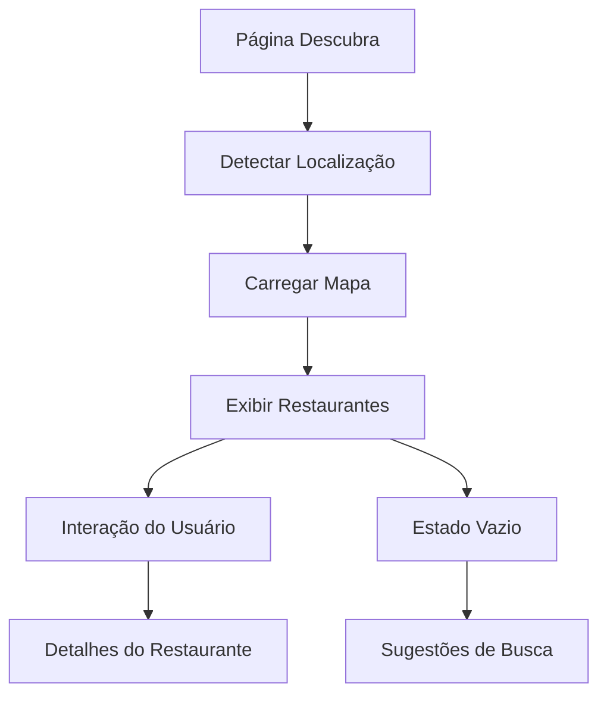

# Documentação da Página Descubra

## 1. Visão Geral do Produto

A página "Descubra" é a principal interface de descoberta de restaurantes do aplicativo Taste, permitindo aos usuários encontrar estabelecimentos próximos através de um mapa interativo e visualizar recomendações personalizadas baseadas em sua localização.

## 2. Funcionalidades Principais

### 2.1 Papéis de Usuário

| Papel | Método de Registro | Permissões Principais |
|-------|-------------------|----------------------|
| Usuário Comum | Registro por email/telefone | Pode visualizar restaurantes, usar mapa, ver avaliações |
| Usuário Autenticado | Login com conta existente | Acesso completo a favoritos, histórico e recomendações personalizadas |

### 2.2 Módulos de Funcionalidade

Nossa página Descubra consiste nas seguintes seções principais:

1. **Header Principal**: logo da marca, texto de boas-vindas "Encontramos lugares com a sua cara"
2. **Seção de Mapa**: mapa interativo com marcadores de restaurantes próximos
3. **Lista de Restaurantes**: cards com informações detalhadas dos estabelecimentos
4. **Navegação Inferior**: acesso rápido para Descubra, Mapa e Perfil
5. **Estado Vazio**: tela de feedback quando não há resultados

### 2.3 Detalhes das Páginas

| Nome da Página | Nome do Módulo | Descrição da Funcionalidade |
|----------------|----------------|-----------------------------|
| Descubra | Header Principal | Exibir logo da marca e texto de boas-vindas "Encontramos lugares com a sua cara" |
| Descubra | Seção de Mapa | Mostrar mapa interativo com marcadores de restaurantes, permitir zoom e navegação |
| Descubra | Cards de Restaurante | Exibir nome, avaliação (estrelas), descrição breve e imagem do prato |
| Descubra | Navegação Inferior | Permitir navegação entre Descubra (ativo), Mapa e Perfil |
| Descubra | Estado Vazio | Mostrar emoji triste, mensagem "Hmm.. não encontramos nada com esse perfil por aqui" e sugestões |

## 3. Processo Principal

**Fluxo do Usuário Principal:**

1. Usuário acessa a página Descubra
2. Sistema detecta localização atual ou usa localização padrão
3. Mapa carrega com marcadores de restaurantes próximos
4. Lista de restaurantes é exibida abaixo do mapa
5. Usuário pode interagir com o mapa ou navegar pelos cards
6. Usuário pode tocar em um restaurante para ver detalhes
7. Se não houver resultados, exibe estado vazio com sugestões

## 4. Design da Interface do Usuário

### 4.1 Estilo de Design

- **Cores Primárias**: #2c3b83 (azul principal), #FF6B35 (laranja de destaque)
- **Cores Secundárias**: Branco para textos em fundos escuros, cinza para textos secundários
- **Estilo de Botões**: Arredondados com bordas suaves, efeito de destaque no estado ativo
- **Fonte**: Sans-serif moderna, tamanhos variados (18px para títulos, 14px para textos, 12px para detalhes)
- **Layout**: Design em cards, navegação inferior fixa, mapa ocupando 40% da tela
- **Ícones**: Estilo outline/filled, emoji para estados emocionais

### 4.2 Visão Geral do Design das Páginas

| Nome da Página | Nome do Módulo | Elementos da UI |
|----------------|----------------|----------------|
| Descubra | Header Principal | Fundo azul #2c3b83, logo centralizada em branco, texto "Encontramos lugares com a sua cara" em branco |
| Descubra | Seção de Mapa | Mapa do Google Maps/Apple Maps, marcadores laranja #FF6B35, altura de 40% da tela |
| Descubra | Cards de Restaurante | Fundo azul #2c3b83, imagem do prato à esquerda, nome em branco bold, estrelas amarelas, descrição em branco |
| Descubra | Navegação Inferior | Fundo laranja #FF6B35, botões brancos, estado ativo com fundo semi-transparente |
| Descubra | Estado Vazio | Fundo azul #2c3b83, emoji 😔, texto branco centralizado, sugestões em texto menor |

### 4.3 Responsividade

A página é projetada mobile-first com adaptação para diferentes tamanhos de tela. Inclui otimizações para interação touch, gestos de zoom no mapa e navegação por swipe nos cards de restaurantes.