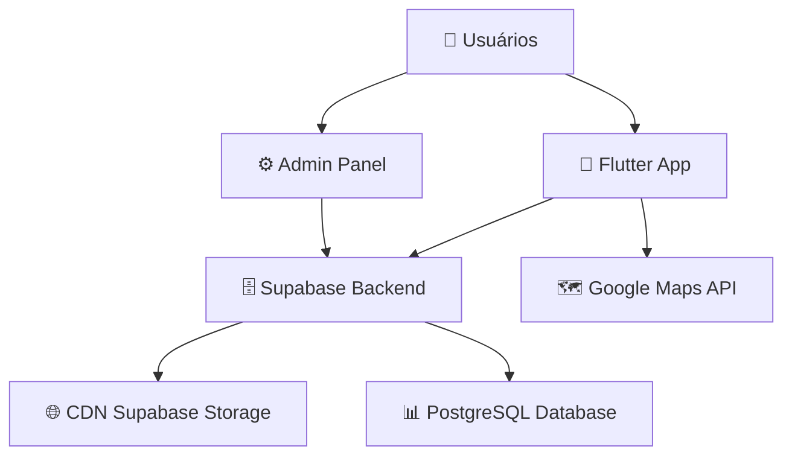

# 🏗️ Arquitetura do Projeto - Gastro App

## 📋 Visão Geral Arquitetural

O Gastro App segue uma arquitetura **Cliente-Servidor moderna** com separação clara de responsabilidades:



---

## 📱 **Frontend Architecture (Flutter)**

### **Design Pattern: MVVM + Repository**

```
┌─ Presentation Layer (UI)
│  ├── Screens/ (Views)
│  ├── Widgets/ (Reusable Components)
│  └── Providers/ (ViewModels - Riverpod)
│
├─ Business Logic Layer
│  ├── Services/ (Use Cases)
│  └── Models/ (Domain Entities)
│
└─ Data Layer
   ├── SupabaseService (Remote Data Source)
   └── LocalStorage (Cache - SharedPreferences)
```

### **Estado Global (Riverpod)**

```dart
// Principais providers implementados:
authStateProvider          // Estado de autenticação
currentUserProvider        // Usuário logado atual
restaurantesProvider       // Lista de restaurantes
localizacaoAtualProvider   // GPS do usuário
estadoBuscaProvider        // Estado da busca IA
favoritosProvider          // Restaurantes favoritos
```

### **Fluxo de Dados**

```
UI Widget → Provider (Riverpod) → Service → Supabase → PostgreSQL
    ↑                                           ↓
    └─── Estado atualizado ←─── Response ←───────┘
```

---

## ⚙️ **Admin Panel Architecture (Next.js)**

### **Design Pattern: Server Components + Client Components**

```
├─ App Router (Next.js 14)
│  ├── /dashboard (Server Component)
│  ├── /login (Client Component)
│  └── middleware.ts (Auth Guard)
│
├─ Components/
│  ├── RestauranteForm.tsx (Client - Form handling)
│  └── RestauranteTable.tsx (Server - Data fetching)
│
└─ lib/
   └── supabase.ts (Client configuration)
```

### **Fluxo de Autenticação**

```
Login → Supabase Auth → Check admins table → Set session → Dashboard
```

---

## 🗄️ **Backend Architecture (Supabase)**

### **Database Schema**

```sql
-- Estrutura principal das tabelas
restaurantes (16 registros reais)
├── id: UUID (PK)
├── nome: TEXT
├── tipo: TEXT (Japonesa, Italiana, etc.)
├── latitude/longitude: FLOAT8
├── tags: TEXT[] (romântico, casual, etc.)
└── imagem_url: TEXT

usuarios
├── id: UUID (PK)
├── auth_id: UUID (FK → auth.users)
├── favoritos: UUID[] (array de IDs)
└── nome, email, avatar_url

experiencias (Sistema de avaliações)
├── id: UUID (PK)
├── usuario_id: UUID (FK)
├── restaurante_id: UUID (FK)
├── emoji: TEXT (😍, 😋, 😐, 😕)
└── comentario: TEXT

admins (Controle de acesso)
├── id: UUID (PK)
└── email: TEXT (whitelist de emails)
```

### **Row Level Security (RLS)**

```sql
-- Políticas implementadas:
- Admin-only access para restaurantes CRUD
- User-specific access para favoritos/experiências
- Public read para restaurantes (app público)
```

### **Storage Structure**

```
images/ (bucket público)
├── restaurantes/
│   ├── {id}/imagem-principal.jpg
│   └── {id}/galeria/
└── users/
    └── avatars/
```

---

## 🔄 **Fluxos de Dados Principais**

### **1. Busca Inteligente**

```
1. Usuário digita: "café tranquilo pra trabalhar"
2. AIService.processarBuscaPorDesejo()
3. Simula análise IA → extrai: tipo="café", tags=["tranquilo", "wi-fi"]
4. RestauranteService.buscarPorFiltros(filtros)
5. Query SQL com WHERE tipo ILIKE %café% AND tags && ARRAY['tranquilo']
6. Retorna lista filtrada → UI atualizada via Provider
```

### **2. Sistema de Favoritos**

```
1. User clica ❤️ no restaurante
2. FavoriteButton → usuarioService.toggleFavorito()
3. UPDATE usuarios SET favoritos = array_append(favoritos, restaurante_id)
4. Provider invalidado → UI re-renderiza
5. Sincronização automática entre dispositivos
```

### **3. Geolocalização + Proximidade**

```
1. LocalizacaoService.obterPosicaoAtual()
2. GPS → lat/lng do usuário
3. Calcular distância para cada restaurante (fórmula haversine)
4. Filtrar por raio selecionado (1-20km slider)
5. Exibir badges coloridas: Verde ≤500m, Laranja ≤2km, Vermelho >5km
```

### **4. Upload de Imagens (Admin)**

```
1. Admin seleciona imagem no form
2. File → Supabase Storage bucket 'images'
3. Retorna URL pública → salva em restaurantes.imagem_url
4. CDN serve imagens globalmente
5. App Flutter carrega automaticamente
```

---

## 🎨 **Design System Architecture**

### **Tema Material 3**

```dart
// Core colors definidos em app_colors.dart
primary: #2C3985 (Azul Profundo)
secondary: #EE9D21 (Amarelo Mostarda)
background: #FBE9D2 (Areia Clara)

// Theme generation
ColorScheme.fromSeed(
  seedColor: AppColors.primary,
  brightness: Brightness.light,
)
```

### **Atomic Design Structure**

```
Atoms: Colors, Typography, Icons
Molecules: Buttons, Input Fields, Cards  
Organisms: RestauranteCard, Header, SearchBar
Templates: Screen Layouts
Pages: Specific Screen Implementations
```

---

## 📊 **Performance & Optimization**

### **Flutter Optimizations**

```dart
// Lazy loading implementado
ListView.builder() para listas grandes
FutureBuilder/StreamBuilder para async data
Image.network() com placeholder/error handling
Riverpod para cache automático de providers
```

### **Next.js Optimizations**

```javascript
// Server Components para performance
Static generation onde possível
Image optimization automática
Bundle splitting automático
Middleware para auth check eficiente
```

### **Database Optimizations**

```sql
-- Índices criados:
CREATE INDEX idx_restaurantes_tipo ON restaurantes(tipo);
CREATE INDEX idx_restaurantes_location ON restaurantes USING GIST (point(longitude, latitude));
CREATE INDEX idx_experiencias_usuario ON experiencias(usuario_id);
```

---

## 🔒 **Security Architecture**

### **Autenticação em Camadas**

```
1. Supabase Auth (JWT tokens)
2. RLS Policies no banco
3. Middleware no Next.js
4. Provider guards no Flutter
```

### **Data Validation**

```
Frontend: Form validation + client checks
Backend: RLS policies + constraint checks
Database: NOT NULL, CHECK constraints, foreign keys
```

---

## 🚀 **Deployment Architecture**

### **Ambiente de Desenvolvimento**

```
Flutter: localhost:8080 (web-server)
Next.js: localhost:3000 (dev server)
Supabase: Cloud hosted (gnosarnyuiyrbcdwkfto.supabase.co)
```

### **Produção Recomendada**

```
Flutter Web: Vercel/Netlify (CDN global)
Flutter Mobile: Play Store / App Store
Next.js: Vercel (serverless functions)
Supabase: Production tier (auto-scaling)
Domain: gastroapp.com.br
```

---

## 📈 **Scalability Considerations**

### **Horizontal Scaling**

- **Supabase**: Auto-scaling PostgreSQL + CDN
- **Frontend**: Stateless → fácil replicação
- **API**: Serverless functions → infinita escalabilidade

### **Performance Monitoring**

```dart
// Implementar em produção:
Sentry para error tracking
Firebase Analytics para user behavior
Supabase metrics para database performance
```

---

## 🔧 **Development Workflow**

### **Git Flow**

```
main (produção)
├── develop (desenvolvimento)
│   ├── feature/busca-avancada
│   ├── feature/notificacoes
│   └── hotfix/bug-login
```

### **Testing Strategy**

```
Unit Tests: Services e Models
Widget Tests: UI Components  
Integration Tests: Fluxos completos
E2E Tests: Critical user journeys
```

---

## 📚 **Documentação Relacionada**

- **Setup:** `SETUP.md` - Configuração inicial
- **Design:** `IDENTIDADE_VISUAL.md` - Sistema de cores e tipografia
- **IA:** `AI_INTEGRATION_GUIDE.md` - Integração com APIs de IA real
- **Auth:** `../SISTEMA_AUTENTICACAO_IMPLEMENTADO.md` - Sistema de autenticação

---

**📝 Nota:** Esta arquitetura foi projetada para suportar milhões de usuários e milhares de restaurantes, mantendo performance e experiência de usuário excelentes. 